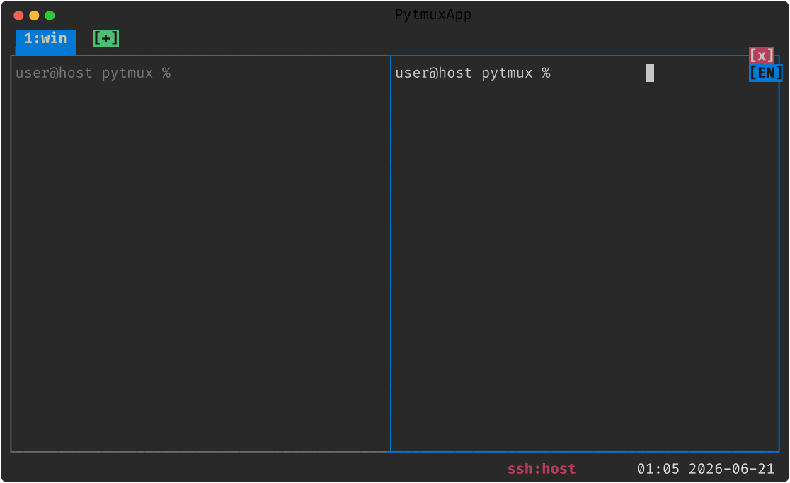

# pytmux

Python + [Textual](https://textual.textualize.io/) 로 만든 **tmux 유사 터미널 멀티플렉서**입니다.
하나의 터미널 안에서 여러 셸을 패널로 나눠 쓰고, 앱이나 터미널 창을 닫아도 셸 세션이
계속 살아있게 해 줍니다.



> 📖 **사용법은 매뉴얼에 있습니다.** 설치부터 패널·탭·마우스·메뉴·명령·Claude 연동·
> 운영까지 **실제 화면 스크린샷**과 함께 안내하는
> **[사용 매뉴얼 → docs/MANUAL.md](docs/MANUAL.md)** 를 보세요. 이 README 는 프로젝트
> 소개입니다.
>
> - 🖼️ **[화면 갤러리 → docs/GALLERY.md](docs/GALLERY.md)** — pytmux 와 플러그인들의
>   주요 화면을 한눈에(스크린샷 + 짧은 설명).
> - 🔌 **[플러그인 매뉴얼 → docs/PLUGIN_MANUAL.md](docs/PLUGIN_MANUAL.md)** — 기본 제공
>   플러그인 소개부터 직접 만드는 법(훅 계약·delete-to-disable)까지.

## 왜 만들었나

- **tmux 를 원격 윈도우 환경에서 쓰기엔 설치·설정 절차가 번거로워서**, 파이썬으로 그냥
  직접 만들기로 했습니다. 파이썬만 있으면 스크립트 하나로 돌아갑니다.
- tmux 와 비슷하게 동작하지만, **명령어를 다 외우지 못하는 사람**과 **마우스를 좀 더
  쓰고 싶은 사람**을 위해 만들어졌습니다. 그래서:
  - 🖱️ **마우스를 1급으로 지원** — 경계선 드래그로 패널 크기 조절, 클릭으로 패널 포커스,
    우클릭으로 메뉴, 휠로 스크롤백.
  - 🧭 **TUI 기반 메뉴** — 단축키를 외우지 않아도 메뉴(`prefix Enter` 또는 우클릭)와
    명령 프롬프트(`prefix :`)로 거의 모든 동작을 할 수 있습니다.

## 특징

- **단일 세션 모델**: 멀티 세션 개념은 없습니다. 항상 하나의 세션으로 시작하고, **탭**으로
  여러 윈도우를 열며 각 윈도우를 패널로 나눕니다(최상위 = 탭).
- **셸 영속성**: 셸 PTY 를 백그라운드 데몬(서버)이 보유합니다. 앱을 닫거나(`detach`)
  상위 터미널 창을 닫아도 셸은 계속 돌아가고, 다시 실행하면 이어서 붙습니다.
- **탭 → 윈도우 → 패널 계층**: 최상위는 **탭**이고, 각 탭에는 **단일 윈도우**가 종속되며,
  그 윈도우를 **패널 집합**으로 분할합니다.
- **상단 탭바**: 탭이 하나여도 상단에 탭 인터페이스(탭 목록 + 마지막 탭 오른쪽의 `[+]`)가
  나타납니다. 활성 탭은 아래 콘텐츠 영역과 **연결된 노트북 탭 모양**으로 이어집니다. 탭은
  **1번부터** 번호가 매겨지고, 마우스 드래그나 명령으로 재정렬할 수 있습니다.
- **상태표시줄 + 색 스키마**: 하단에 탭 목록·줌 상태·시계 표시. **다중 줄 상태표시줄**도
  설정할 수 있습니다. 색은 Textual `textual-dark` 팔레트. 시계를 클릭하면 시계 모드,
  날짜를 클릭하면 이번 달 달력 오버레이가 토글됩니다.
- **패널별 스크롤백**: copy-mode 로 따로 들어가지 않아도, 패널 위에서 휠을 올리면 바로
  지난 출력을 봅니다. 패널마다 독립적입니다.
- **마우스 + 키보드 + 메뉴** 세 가지 방식 모두로 제어.
- **활성 패널 테두리**: 패널이 둘 이상이면 각 패널을 테두리 박스로 감싸고, **현재 활성
  패널의 테두리를 파란색**, 비활성은 회색으로 표시합니다(경계는 인접 패널과 `┬┴├┤` 로 연결).
- **패널 swap(교환)**: **Shift+왼쪽 버튼 드래그**로 두 패널의 위치를 맞바꿉니다. 명령
  `swap-pane`/`rotate-window` 도 지원합니다.
- **런타임 키 바인딩**: `bind-key` / `unbind-key` / `list-keys` 로 설정 파일을 고치지
  않고도 실행 중에 키 바인딩을 바꿀 수 있습니다.
- **붙여넣기 패스스루**: 멀티라인 텍스트 붙여넣기를 bracketed paste 로 그대로 전달하여
  Claude Code CLI 등에서 줄마다 실행되지 않고 한 번에 붙습니다. 이미지 붙여넣기도 동일.
- **토큰 리밋 자동 재개**: 패널에서 돌리던 Claude Code 등이 사용량 리밋에 걸려 멈추면,
  출력의 해제 시각을 읽어 그때가 되면 자동으로 재개합니다(`prefix R` 토글, 상태줄 `AR`).
- **Claude Code 상태 표시**: 실행 중인 탭에 상태 아이콘(**대기 `○` / 처리중 `◐` / 리밋
  멈춤 `⊘`**)을 표시하고, 비활성 탭의 작업이 끝나면 탭 배경색으로 알립니다. 보낸 프롬프트
  이력은 `prompt-history`(claude-prompt-history 플러그인)로 미리보기·점프합니다.
- **Claude 토큰 사용량 / 권한모드 / 시작 규칙**: 활성 Claude 패널의 토큰·컨텍스트를
  상태줄에 표시(클릭 시 사용량 트리 팝업), 권한모드 footer 클릭 시 선택 팝업(auto/default/
  plan), `claude-rules` 로 시작 규칙 자동 주입, `auto-doc-clear` 로 idle 시 자동 문서화+clear.
- **네트워크 응답성 표시 + 회복**: 클라↔서버 IPC 지연이 커지면 패널 외곽선을 **빨간색**
  으로 표시하고, 고착되면 `reconnect`(또는 워치독 자동)으로 **실행 중 셸/Claude 를 죽이지
  않고** IPC 만 다시 세워 반응성을 회복합니다.
- **작업 보존 서버 재시작**: `restart-server`(서버만)·`restart-all`(서버+클라 동시)·
  `restart-check`(드라이런)로, 열린 패널의 **셸·실행 중 프로그램·스크롤백을 살린 채 코드만
  새 이미지로 교체**합니다(제자리 re-exec).
- **플러그인 시스템(delete-to-disable)**: 시계·달력·디렉토리 트리(ncd)·IME 한/영 배지·
  Claude Code 통합·프롬프트 히스토리·사용 한도 화면·퍼포스 CL 목록이 모두
  `pytmuxlib/plugins/<name>/` 디렉토리 하나로 응집된 **플러그인**입니다. 디렉토리를 지우면
  그 기능이 명령·자동완성·렌더 어디에도 안 나타나고 조용히 사라집니다(코어는 레지스트리
  훅 + `getattr` 가드로만 닿음). 만드는 법은 [docs/PLUGIN_MANUAL.md](docs/PLUGIN_MANUAL.md).
- **크로스플랫폼**: macOS/Linux(POSIX PTY) + **Windows 네이티브(ConPTY)** 백엔드.

## 설치

```sh
pip install -r requirements.txt
# 또는 직접: pip install textual pyte wcwidth
```

> **macOS / Linux**(POSIX PTY)에서 동작합니다. Python 3.11 이상 권장.
> **Windows** 네이티브(WSL/Cygwin 불필요)도 **ConPTY** 백엔드로 지원합니다 —
> `pip install pywinpty` 가 추가로 필요합니다. 실 Windows 11 기기에서 스모크 검증을
> 마쳤습니다.

### `pytmux` 명령으로 등록 (선택)

`python3 pytmux.py` 대신 어디서든 `pytmux` 로 실행하려면 래퍼를 설치합니다.

```sh
./install.sh                  # 기본 위치(~/.local/bin)에 'pytmux' 래퍼 설치
./install.sh /usr/local/bin   # 다른 디렉터리에 설치
BIN=pt ./install.sh           # 다른 이름(pt)으로 설치
./uninstall.sh                # 제거(설치 시 쓴 DIR/BIN 인자를 동일하게)
```

Windows(PowerShell)에서는 `install.ps1` / `uninstall.ps1` 을 사용합니다.

### SSH/mosh 접속 시 자동 실행 (선택)

원격 로그인하면 곧바로 pytmux 세션으로 들어가도록 셸 설정(`~/.zshrc` 등)에 아래를
추가합니다(tmux 의 `tmux new-session -A -s main` 자동 실행 대체).

```sh
# 인터랙티브 SSH/mosh 로그인일 때만 pytmux 세션에 attach.
# $LC_PYTMUX = pytmux 패널에서 들어온 원격 로그인 표식(중첩 방지 — pytmux 자체도
# 거부하지만 가드에서 먼저 거르면 거부 메시지·단말 질의 비용 없이 조용히 지나간다).
if command -v pytmux >/dev/null && [[ -o interactive ]] && [[ -t 1 ]] \
   && [[ -z "$PYTMUX" ]] && [[ -z "$LC_PYTMUX" ]] \
   && [[ -n "$SSH_CONNECTION$SSH_TTY" ]]; then
  pytmux
fi
```

> ⚠️ `exec pytmux` 는 권하지 않습니다 — pytmux 가 (중첩 거부 등으로) 즉시 종료하면
> 로그인 셸이 함께 죽고, autossh 등 자동 재접속과 만나면 **재접속 루프**가 됩니다.
> pytmux 는 중첩을 env 마커 + 단말 질의(XTVERSION) 두 겹으로 감지해 이중 실행을
> 거부합니다.

## 빠른 시작

```sh
python3 pytmux.py        # 서버가 없으면 자동 기동 후 attach, 있으면 attach
# 래퍼를 설치했다면 어디서든:
#   pytmux              attach (없으면 기동)
#   pytmux ls           탭/패널 요약
#   pytmux kill-server  서버와 모든 탭/셸 종료
#   pytmux cmd new-tab  외부에서 서버 제어(split-window -h, rename-tab …)
```

처음 실행하면 평소 쓰던 셸이 전체 화면으로 뜹니다. `Ctrl-b`(prefix)를 누른 뒤 명령
키를 누르거나, 마우스/메뉴로 조작하면 됩니다.

**자세한 사용법** — 키 바인딩, 마우스 조작, 메뉴·명령 프롬프트, 스크롤백, 설정 파일,
Claude Code 연동, 작업 보존 재시작까지 — 은 **[사용 매뉴얼(docs/MANUAL.md)](docs/MANUAL.md)**
에 실제 화면 스크린샷과 함께 정리돼 있습니다.

## 문서

- **[docs/MANUAL.md](docs/MANUAL.md) — 📖 상세 사용 매뉴얼(실제 화면 스크린샷 포함). 처음
  쓰신다면 여기부터.**
- [docs/GALLERY.md](docs/GALLERY.md) — 🖼️ 화면 갤러리: pytmux 본체와 8개 플러그인의 주요
  화면을 스크린샷 + 짧은 설명으로 한눈에.
- [docs/PLUGIN_MANUAL.md](docs/PLUGIN_MANUAL.md) — 🔌 플러그인 매뉴얼: 작성법·훅 계약·
  delete-to-disable 원칙 + 기본 제공 8개 플러그인 사례. 플러그인을 직접 만들려면 여기부터.
- [docs/FEATURES.md](docs/FEATURES.md) — tmux 대비 기능 제안과 구현 현황
- [docs/CONTRIBUTING.md](docs/CONTRIBUTING.md) — 기여/서브밋 규칙

## 상태

`docs/FEATURES.md` 의 모든 기능(패널/탭/단일 세션/복사 모드/명령·설정/상태줄·탭바·UI/
통합·자동화)이 구현되어 있습니다. 구현은 `pytmuxlib/` 패키지로 모듈화되어 있고
(`server`/`client`/`model`/`protocol`/`claude`/플랫폼 추상층 등), `pytmux.py` 가
진입점입니다. macOS/Linux 에 더해 **Windows 네이티브(ConPTY)** 백엔드를 지원하며 실
Windows 11 기기에서 스모크 검증을 마쳤습니다. 헤드리스 테스트는 `python tests/run.py` 로
전부 통과합니다(현재 591 passed). 매뉴얼·갤러리의 스크린샷은 실제 클라이언트를 헤드리스로
운전해 자동 생성하며(`python3 scripts/gen_screenshots.py`), Claude 연동 컷은 진짜
`claude` 를 패널에서 돌려 캡처합니다.
