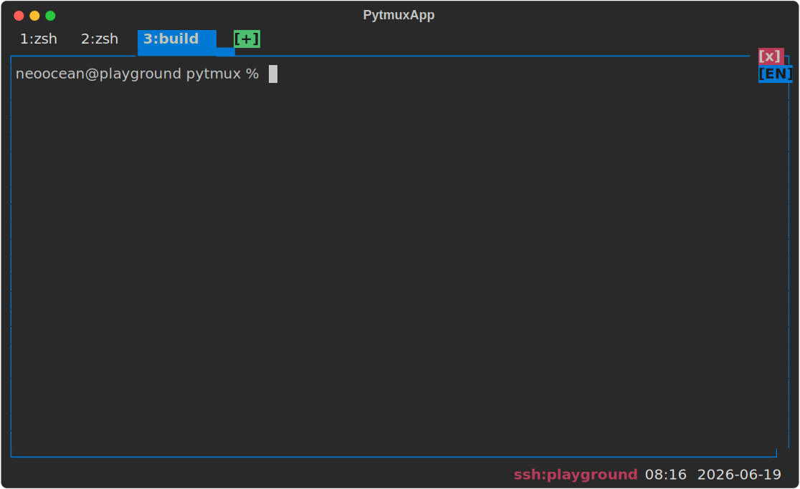
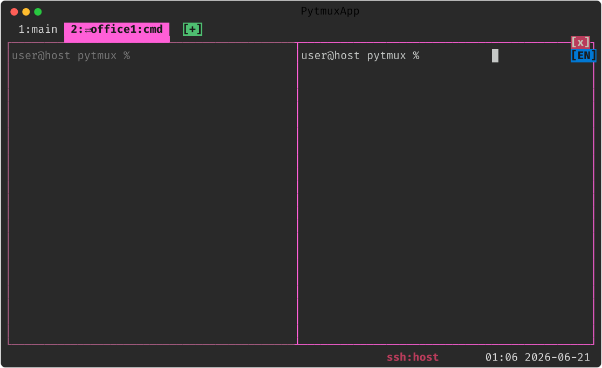
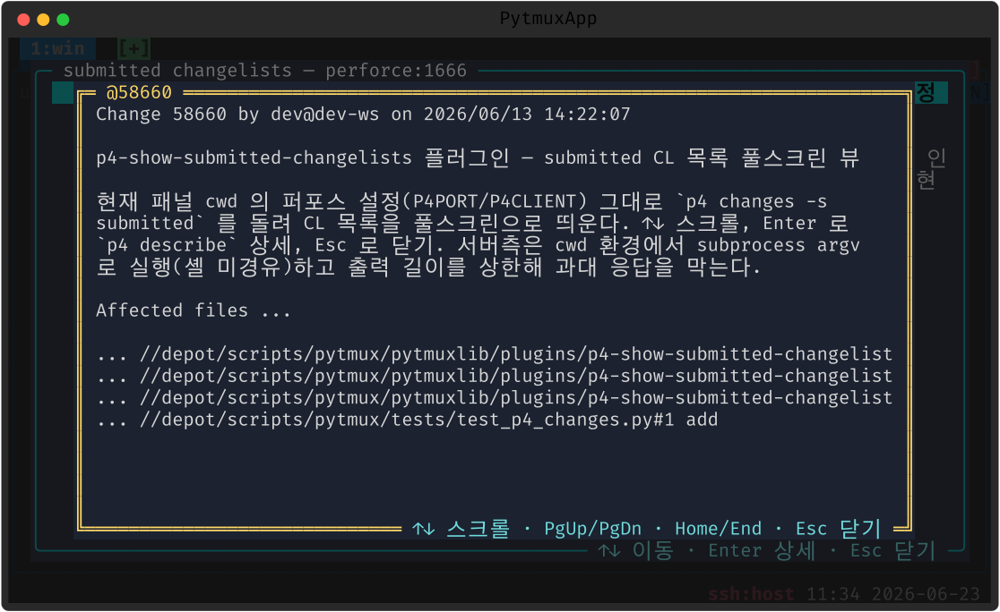

# pytmux 화면 갤러리

pytmux 본체와 기본 제공 플러그인들의 주요 화면을 한눈에 모았습니다. 모든 스크린샷은
**실제 클라이언트를 헤드리스로 운전해 자동 생성**합니다(`python3 scripts/gen_screenshots.py`,
방식은 [SCREENSHOT_SCENARIO.md](SCREENSHOT_SCENARIO.md)) — 수작업 캡처가 아니라 코드가
그리는 실제 프레임입니다.

> 처음 쓰신다면 [📖 사용 매뉴얼(MANUAL.md)](MANUAL.md), 플러그인을 만들려면
> [🔌 플러그인 매뉴얼(PLUGIN_MANUAL.md)](PLUGIN_MANUAL.md) 을 보세요.

---

## 1. 한 터미널, 여러 패널

하나의 터미널을 패널로 나눠 씁니다. **활성 패널은 파란 테두리**, 비활성은 회색이고
경계는 인접 패널과 `┬┴├┤` 로 이어집니다. 닫아도 셸은 백그라운드 데몬이 들고 있어
다시 붙으면 그대로 이어집니다.

한 패널만 전체화면으로 키우는 **줌**(상태줄에 `Z`):

---

## 2. 탭

최상위는 **탭**입니다. 탭이 하나여도 상단 탭바(+ 마지막 탭 오른쪽 `[+]`)가 나오고,
활성 탭은 아래 콘텐츠와 **노트북 탭 모양**으로 이어집니다. 드래그·명령으로 재정렬합니다.

---

## 3. 외우지 않아도 되는 조작 — 메뉴 · 명령 프롬프트

단축키를 다 외우지 않아도 **우클릭 메뉴**(또는 `prefix Enter`)와 **명령 프롬프트**
(`prefix :`)로 거의 모든 동작을 할 수 있습니다. 명령 프롬프트는 입력하는 동안
**고스트 자동완성**으로 다음 글자를 제안합니다.

`?`(또는 `help`)로 여는 **명령 목록 팝업** — 카테고리 탭·검색·스크롤:

---

## 4. 스크롤백 · 네트워크 상태

copy-mode 로 따로 들어가지 않아도 패널 위에서 **휠을 올리면 바로 지난 출력**을 봅니다
(패널마다 독립).

클라↔서버 IPC 지연이 커지면 패널 외곽선을 **빨간색**으로 알리고, 고착되면 실행 중
셸/Claude 를 죽이지 않고 IPC 만 다시 세워 회복합니다.

---

## 5. 원격 pytmux 탭 어태치 — 분홍 탭·분홍 외곽선

ssh 안에서 pytmux 를 또 띄우는 중첩 대신, 다른 머신의 pytmux 탭을 **이 pytmux 의 탭바로
그대로** 가져옵니다(`remote-attach <host>`). 원격 탭은 `⇄host:이름` **분홍 탭**으로
병합되고, 그 탭을 보는 동안 **패널 외곽선까지 분홍**이라 로컬과 한눈에 구분됩니다. 원격
셸에서 그냥 `pytmux` 를 쳐도 바깥 pytmux 가 자동으로 어태치합니다(`nest-auto-attach`, 기본 ON).

> 동작 원리·전제(키 인증/ControlMaster)는 [REMOTE_ATTACH_SCENARIO.md](REMOTE_ATTACH_SCENARIO.md),
> 원격 실행 자동 승격은 [NESTED_ATTACH_SCENARIO.md](NESTED_ATTACH_SCENARIO.md).

---

## 6. 작업 보존 재시작

`restart-server`/`restart-all` 은 열린 패널의 **셸·실행 중 프로그램·스크롤백을 살린 채
코드만 새 이미지로 교체**합니다(제자리 re-exec). `restart-check` 드라이런으로 먼저
안전을 점검합니다.

---

## 7. 플러그인

아래 기능은 모두 `pytmuxlib/plugins/<name>/` 디렉토리 하나로 응집된 **플러그인**입니다.
디렉토리를 지우면 그 기능이 명령·자동완성·렌더 어디에도 안 나타나고 조용히 사라집니다
(**delete-to-disable**). 만드는 법은 [PLUGIN_MANUAL.md](PLUGIN_MANUAL.md).

### 🕐 clock — 큰 블록 시계

패널 전체를 큰 블록 시계로 덮습니다(`:clock-mode`, 상태줄 시각 클릭, `prefix t`). 뒤
패널 출력은 흐리게(dim) 유지됩니다.

### 📅 calendar — 큰 달력

패널을 이번 달 달력으로 덮고 오늘을 강조합니다(`:calendar-mode`, 상태줄 날짜 클릭).
패널이 충분히 크면 자동으로 블록-숫자 달력이 됩니다.

### 🗂️ ncd — 디렉토리 트리 (Norton Change Directory 풍)

`:ncd`(별칭 `nc`)로 루트→cwd 까지 펼친 디렉토리 트리를 띄웁니다. ↑↓ 탐색·이름 타이핑
즉시 찾기·Enter 로 그 디렉토리로 `cd`·⇧Enter/^O 로 새 패널에서 열기.

### 한/영 ime-indicator — IME 상태 배지

화면 우상단에 현재 입력기(한/영) 상태를 작은 배지(`[한]`/`[EN]`)로 표시합니다. macOS 는
OS 입력소스를 실측해 **입력 없이도 즉시** 따라옵니다.

![IME 한/영 배지 — 우상단 [한]](image/33-ime.svg)

### 🤖 claude-code — Claude Code 통합

실행 중인 Claude Code 의 상태(대기 `○`/처리중 `◐`/리밋 `⊘`)·토큰·컨텍스트를 추적하고,
권한모드·시작 규칙·자동 문서화 등 다양한 자동화를 제공합니다.

권한모드 footer 클릭 → 선택 팝업(auto/default/plan):

토큰 절감 설정(`token-saver`) — 자동 개입 토글·잔량 임계·실측 게이트:

토큰 사용량(`token-log`) — 기간(시/일/주/월)·계정·세션 뷰 + 실측 한도:

시작 규칙 편집(`claude-rules`) — 새 세션/`/clear` 후 프롬프트에 자동 주입:

### 📝 claude-prompt-history — 프롬프트 히스토리

Claude 패널에 입력한 프롬프트를 시간순으로 모아 팝업(`prompt-history`, 별칭 `prompts`·`ph`)
으로 보거나, `:` 작성 중엔 직전 프롬프트를 미리보기로 띄웁니다.

### 📊 claude-token-usage-view — 사용 한도 + 리셋 카운트다운

`usage-view` 로 Claude 사용 한도 막대(% 우측정렬)와 다음 리셋까지 블록-숫자 카운트다운을
한 화면에 보여줍니다.

### 🧾 p4-show-submitted-changelists — 퍼포스 CL 목록

`p4changes`(별칭 `submitted`)로 현재 패널 cwd 의 퍼포스 설정 그대로 submitted CL 목록을
풀스크린으로 띄웁니다. ↑↓ 스크롤·Enter 로 `p4 describe` 상세 팝업.

목록에서 CL 하나에 **Enter** 를 누르면 그 위로 `p4 describe` 상세 팝업이 올라옵니다 —
제목에 `@CL`, 본문에 변경 설명과 영향 파일 목록(↑↓·PgUp/PgDn 스크롤, Esc 로 목록 복귀).

---

> 이 갤러리의 스크린샷을 다시 만들려면: `python3 scripts/gen_screenshots.py`(전체) 또는
> `python3 scripts/gen_screenshots.py <필터>`(예: `31-prompt-history`). 새 장면을 추가하면
> 같은 생성기에 등록하세요(수작업 캡처 금지).
