# pytmux 매뉴얼

이 문서는 **pytmux** 를 처음 쓰시는 분부터 일상적으로 쓰시는 분까지 참고하실 수 있도록,
설치 → 첫 실행 → 패널/탭 다루기 → 마우스·메뉴·명령 → Claude Code 연동 → 설정·운영까지
**실제 화면 스크린샷**과 함께 차근차근 설명합니다.

> 더 짧은 요약은 [README](../README.md), 설계/내부는 [DESIGN.md](DESIGN.md),
> 기능 목록은 [FEATURES.md](FEATURES.md) 를 참고하세요.

---

## 목차

1. [pytmux 가 무엇인가요](#1-pytmux-가-무엇인가요)
2. [설치](#2-설치)
3. [첫 실행 — 화면 한 바퀴](#3-첫-실행--화면-한-바퀴)
4. [핵심 개념: 탭 → 윈도우 → 패널, 그리고 영속성](#4-핵심-개념-탭--윈도우--패널-그리고-영속성)
5. [패널 다루기 (분할·이동·크기·줌·교환)](#5-패널-다루기)
6. [탭 다루기 (생성·전환·이름·재정렬)](#6-탭-다루기)
7. [스크롤백(복사 모드)](#7-스크롤백복사-모드)
8. [마우스로 거의 다 하기](#8-마우스로-거의-다-하기)
9. [메뉴와 명령 프롬프트](#9-메뉴와-명령-프롬프트)
10. [붙여넣기 · 클립보드 · 이미지](#10-붙여넣기--클립보드--이미지)
11. [Claude Code 연동](#11-claude-code-연동)
12. [상태줄·시계·달력·정보 팝업](#12-상태줄시계달력정보-팝업)
13. [detach / attach 와 셸 영속성](#13-detach--attach-와-셸-영속성)
14. [네트워크 응답성과 재접속](#14-네트워크-응답성과-재접속)
15. [작업 보존 서버 재시작](#15-작업-보존-서버-재시작)
16. [설정 파일](#16-설정-파일)
17. [명령 레퍼런스](#17-명령-레퍼런스)
18. [키 바인딩 레퍼런스](#18-키-바인딩-레퍼런스)
19. [외부에서 서버 제어 (CLI)](#19-외부에서-서버-제어-cli)
20. [문제 해결 FAQ](#20-문제-해결-faq)

---

## 1. pytmux 가 무엇인가요

pytmux 는 Python + [Textual](https://textual.textualize.io/) 로 만든 **tmux 유사 터미널
멀티플렉서**입니다. 하나의 터미널 창 안에서 여러 셸을 패널로 나눠 쓰고, 앱이나 터미널
창을 닫아도 셸 세션이 계속 살아 있게 해 줍니다.

tmux 와 다른 점은 **마우스와 메뉴를 1급으로 지원**한다는 것입니다. 단축키를 다 외우지
않아도, 우클릭 메뉴(`prefix Enter`)와 명령 프롬프트(`prefix :`)로 거의 모든 동작을 하실
수 있습니다. 경계선을 드래그해 패널 크기를 바꾸고, 휠을 굴려 스크롤백을 봅니다.

구조는 **클라이언트 ↔ 서버**입니다. 셸 PTY 는 백그라운드 데몬(서버)이 보유하고, 화면을
그리는 앱(클라이언트)은 거기에 붙었다 떨어졌다 합니다. 그래서 앱을 닫아도 셸은 죽지
않습니다.

---

## 2. 설치

### 2.1 의존성

```sh
pip install -r requirements.txt
# 또는 직접: pip install textual pyte wcwidth
```

- **macOS / Linux** (POSIX PTY) 에서 동작합니다. Python 3.11 이상을 권장합니다.
- **Windows** 네이티브(WSL/Cygwin 불필요)는 **ConPTY** 백엔드로 지원합니다.
  추가로 `pip install pywinpty` 가 필요합니다(`requirements.txt` 에 `win32` 조건부 포함).
  자세한 범위는 [WINDOWS_PORT.md](WINDOWS_PORT.md) 를 참고하세요.

### 2.2 `pytmux` 명령으로 등록 (선택)

어디서든 `python3 pytmux.py` 대신 `pytmux` 로 실행하시려면 래퍼를 설치합니다.

```sh
./install.sh                  # 기본 위치(~/.local/bin)에 'pytmux' 래퍼 설치
./install.sh /usr/local/bin   # 다른 디렉터리에 설치
BIN=pt ./install.sh           # 다른 이름(pt)으로 설치

./uninstall.sh                # 제거(설치 시 쓴 DIR/BIN 인자를 동일하게)
```

Windows(PowerShell) 에서는 `install.ps1` / `uninstall.ps1` 을 사용합니다.

### 2.3 SSH/mosh 접속 시 자동 attach (선택)

원격 로그인하면 곧바로 pytmux 세션으로 들어가도록 셸 설정(`~/.zshrc` 등)에 아래를
추가합니다. tmux 의 `tmux new-session -A -s main` 자동 실행을 대체하는 용도입니다.

```sh
# 인터랙티브 SSH/mosh 로그인일 때만 pytmux 세션에 attach.
if command -v pytmux >/dev/null && [[ -o interactive ]] && [[ -t 1 ]] \
   && [[ -z "$PYTMUX" ]] && [[ -n "$SSH_CONNECTION$SSH_TTY" ]]; then
  pytmux
fi
```

중첩 방지 가드는 pytmux 가 패널 셸에 심는 `$PYTMUX` 환경변수를 검사합니다(비인터랙티브
도구 셸은 가로채지 않으므로 자동화 명령을 막지 않습니다).

---

## 3. 첫 실행 — 화면 한 바퀴

```sh
python3 pytmux.py     # 서버가 없으면 자동 기동 후 attach, 있으면 attach
# 래퍼를 설치하셨다면 어디서든:  pytmux
```

처음 실행하면 평소 쓰시던 셸이 거의 전체 화면으로 뜹니다. 위에는 **탭바**, 아래에는
**상태줄**이 있습니다.

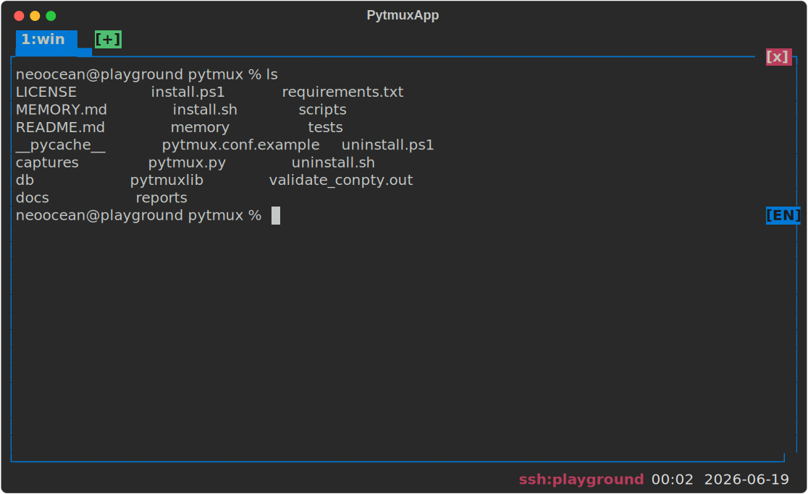

화면 요소는 다음과 같습니다.

- **상단 탭바** — 탭 목록 + 마지막 탭 오른쪽의 `[+]`(새 탭 추가). 탭이 하나여도 기본
  표시됩니다(`set tab-bar auto` 면 2개 이상일 때만 표시). 활성 탭은 아래 콘텐츠와 **연결된
  노트북 탭 모양**(활성색 배경 블록)으로 이어집니다.
- **`[x]`** — 콘텐츠 영역 오른쪽 위 모서리입니다. 현재 탭 닫기(확인 팝업).
- **콘텐츠 영역** — 현재 탭의 윈도우(패널 집합)입니다. 패널이 하나면 테두리는 옵션입니다.
- **하단 상태줄** — `[세션]` · 탭 목록(현재 탭 `*` 표시) · 줌 상태 · 오른쪽에 시계/날짜.

조작은 세 가지 방식 모두 가능합니다.

1. **키보드** — `Ctrl-b`(prefix)를 누른 뒤 명령 키.
2. **마우스** — 클릭(포커스), 드래그(크기·swap), 휠(스크롤백), 우클릭(메뉴).
3. **메뉴/명령** — `prefix Enter`(메뉴), `prefix :`(명령 프롬프트).

---

## 4. 핵심 개념: 탭 → 윈도우 → 패널, 그리고 영속성

pytmux 는 **단일 세션 모델**입니다. tmux 처럼 여러 세션을 만들지 않습니다. 대신 다음과
같은 계층을 가집니다.

```
세션 (단 하나)
└─ 탭 1 ──── 윈도우 ──┬─ 패널 A
│                   └─ 패널 B
└─ 탭 2 ──── 윈도우 ──── 패널 C
└─ 탭 3 ──── 윈도우 ──┬─ 패널 D
                     ├─ 패널 E
                     └─ 패널 F
```

- **탭(최상위)** — 새 탭을 만들면 새 터미널 윈도우(단일 패널)가 열립니다. 1번부터 번호.
- **윈도우** — 각 탭에 종속된 단일 윈도우입니다. 이를 **패널 집합**으로 분할합니다.
- **패널** — 실제 셸 PTY 하나입니다. 좌우/상하로 쪼개 여러 개를 동시에 봅니다.

> tmux 용어로는 pytmux 의 "탭" = tmux 의 "window", pytmux 의 "패널" = tmux 의 "pane"
> 입니다. 그래서 탭 명령은 `new-tab` 과 `new-window` 두 이름을 **모두** 받습니다.

**셸 영속성**: 셸 PTY 를 서버(백그라운드 데몬)가 보유하므로, 앱을 닫거나(`prefix d`
detach), 상위 터미널 창을 닫아도 셸은 계속 돌아갑니다. 다시 `pytmux` 하면 이어서 붙습니다.

---

## 5. 패널 다루기

### 5.1 분할

- `prefix %` — **좌우 분할**(세로선으로 나눔)
- `prefix "` — **상하 분할**(가로선으로 나눔)

`prefix %` 를 한 번 누르면 이렇게 됩니다. 오른쪽(활성) 패널 테두리가 **파란색**,
왼쪽(비활성)이 회색입니다.


패널이 둘 이상이면 각 패널이 테두리 박스로 감싸지고, **현재 활성(포커스) 패널의 테두리
전체가 파란색**, 비활성은 회색입니다. 인접 패널 경계는 `┬ ┴ ├ ┤` 로 연결됩니다.

이어서 한쪽 패널을 `prefix "` 로 한 번 더(상하) 분할하면 세 패널이 됩니다 — 경계가
`┬ ┴ ├ ┤` 로 이어진 모습을 볼 수 있습니다.

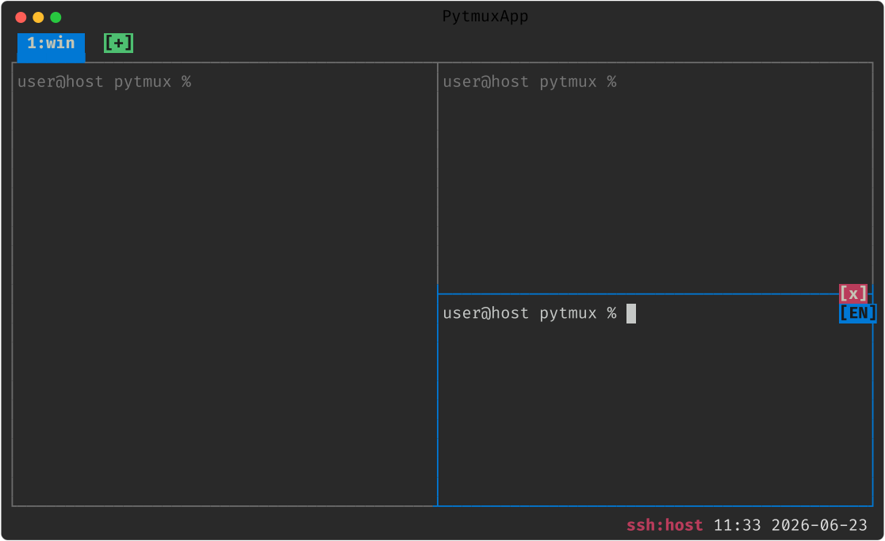

### 5.2 포커스 이동

- `prefix o` — 다음 패널로 순환
- `prefix ←` `↑` `↓` `→` — 방향으로 패널 이동
- **마우스 클릭** — 해당 패널로 즉시 포커스
- `ESC` 모드에서 `←↑↓→` — prefix 없이 패널 이동(명령 모드)

### 5.3 크기 조절

- `prefix H` `J` `K` `L` — 패널 경계를 왼/아래/위/오른쪽으로 이동
- **경계선 드래그** — 마우스로 패널 사이 경계를 끌어 크기 변경

> 한글 IME 가 켜진 상태에서 `prefix H/J/K/L`(시프트 구분이 안 되는 두벌식)은 동작이
> 애매할 수 있습니다. 이때는 마우스 드래그나 영문 입력 상태를 사용하세요.

### 5.4 줌 (한 패널 전체화면 토글)

- `prefix z` 또는 명령 `resize-pane -Z`

줌하면 해당 패널이 콘텐츠 영역을 가득 채우고, 상태줄에 `Z` 표시가 뜹니다. 다시 누르면
원래 레이아웃으로 복귀합니다.

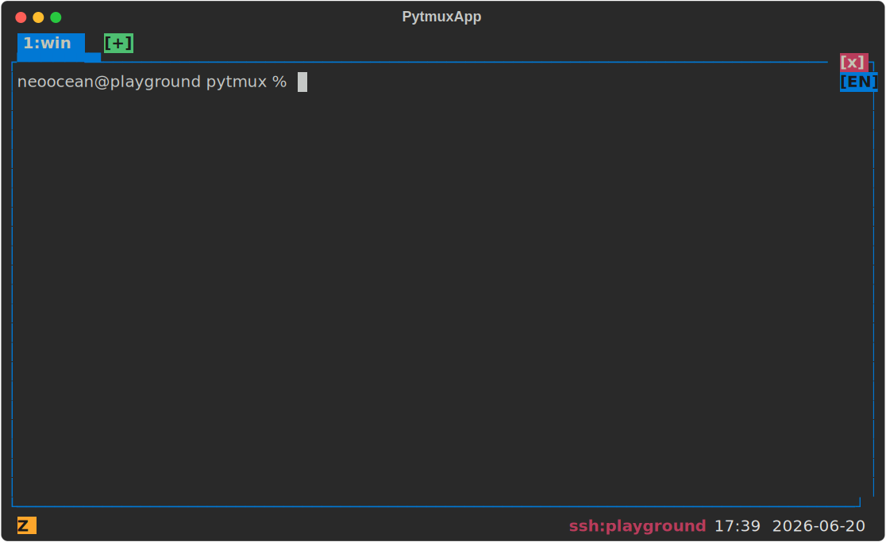

### 5.5 패널 교환(swap)·회전

- **Shift + 왼쪽 버튼 드래그** — 두 패널 위치를 맞바꿉니다(드래그 중 원본은 흐리게,
  대상은 강조).
- 명령 `swap-pane -t <n>` — 현재 패널과 n 번 패널 교환
- 명령 `rotate-window` — 윈도우 안 패널들을 회전

### 5.6 삭제

- `prefix x` — 현재 패널 삭제(`kill-pane? (y/N)` 확인 뒤 `y`).
- **명령으로 삭제** — `ESC` 를 눌러 명령 모드로 들어간 뒤 `:` 로 명령 프롬프트를 열고
  **`kill-pane`** 을 입력해 Enter 합니다(`prefix :` 로 바로 열어도 됩니다). 아래는 두
  패널 중 하나를 닫으려고 명령 프롬프트에 `kill-pane` 을 입력한 모습입니다(오른쪽에
  `현재 패널 삭제` 설명 힌트).

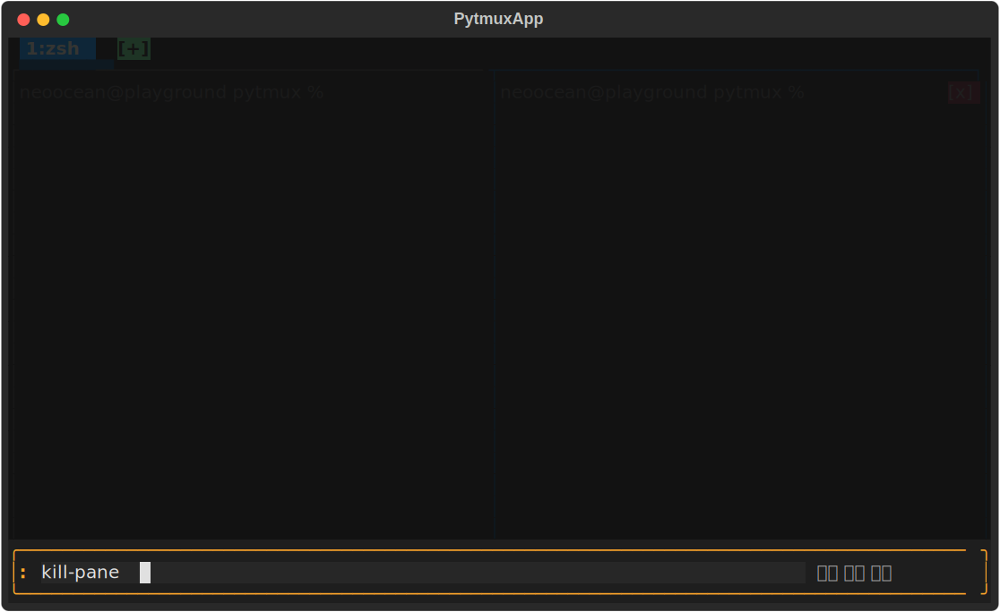

### 5.7 레이아웃 저장/복원

- `layout-save <name>` — 현재 탭 레이아웃을 이름으로 저장
- `layout-load <name>` — 저장 레이아웃을 현재 탭에 덮어쓰기(이름 생략 시 선택기)
- `layout-load-new <name>` — 저장 레이아웃을 새 탭으로 열기
- `next-layout` — 프리셋 레이아웃 순환

---

## 6. 탭 다루기

### 6.1 생성·전환

- `prefix c` — 새 탭(새 윈도우, 단일 패널)
- `prefix n` / `prefix p` — 다음/이전 탭
- `prefix l` — 직전 탭(마지막으로 보던 탭)
- `prefix 1` ~ `prefix 9` — 번호로 탭 선택(**1번부터**)
- **탭바 탭 클릭** — 해당 탭으로 전환
- **`[+]` 클릭** — 새 탭

탭이 여러 개면 탭바는 이렇게 보입니다(아래는 탭 3개 중 하나를 `build` 로 이름변경한
모습 — 활성 탭은 아래 콘텐츠와 색으로 이어지고, 마지막 탭 오른쪽에 `[+]`).

![탭 여러 개 — 활성 탭 강조, 이름변경한 build 탭, 오른쪽 [+]](image/08-tabs-multi.svg)

> 위 그림의 탭바는 실제 화면입니다. Claude Code 가 도는 탭에는 상태 아이콘
> (`○`/`◐`/`⊘`)이 함께 표시됩니다([§11.1](#111-상태-아이콘)).

### 6.2 이름변경

- `prefix ,` — 탭 이름변경(입력창)
- 명령 `rename-tab <name>` (= `rename-window`)

POSIX 에서는 포그라운드 프로세스(`fg`)를 기반으로 탭 이름이 자동으로 따라갑니다(ssh
감지 등).

### 6.3 재정렬

- **탭바에서 탭 드래그** — 마우스로 순서 변경
- `ESC` 모드로 탭바를 하이라이트한 뒤 **Shift+←→ 로 이동, Enter 로 확정**
- 명령 `move-tab-left` / `move-tab-right` / `move-tab-first` / `move-tab-last`

### 6.4 ESC 모드에서 탭바 다루기

`ESC` 를 눌러 명령 모드로 들어간 뒤 **위 방향키로 탭바에 포커스**를 올리면 다음 키를
쓰실 수 있습니다.

- `←` `→` — 탭 선택
- `Enter` — 전환
- `+` / `a` — 새 탭 추가
- `x` / `d` — 탭 닫기
- `Shift+←→` — 탭 이동(재정렬), `Enter` 로 확정

### 6.5 삭제

- `prefix &` — 현재 탭 삭제(확인)
- 콘텐츠 오른쪽 위 **`[x]` 클릭** — 현재 탭 닫기(확인)
- 명령 `kill-tab` (= `kill-window`)

탭을 닫을 때는 **중앙 확인 박스**가 뜹니다. 탭이 둘 이상이면 그 탭만 닫는 일반 확인입니다.

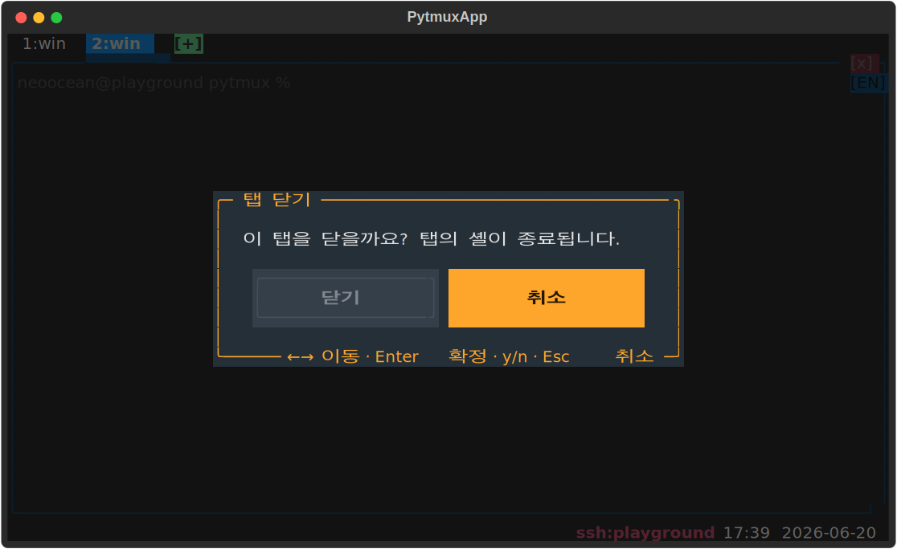

**마지막 탭을 닫을 때**는 의미가 다릅니다 — 그 탭을 닫으면 **pytmux 자체가 종료**되고
**모든 셸이 함께 종료**되므로, 일반 확인 대신 **"pytmux 종료" 경고 팝업**이 떠 한 번 더
확인을 받습니다(기본 포커스는 안전하게 `취소`에 있습니다).

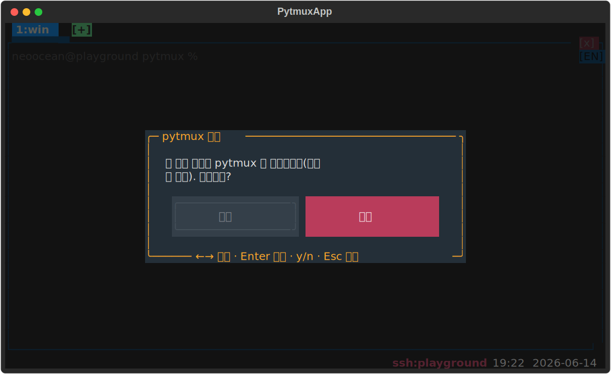

---

## 7. 스크롤백(복사 모드)

tmux 와 달리 copy-mode 로 따로 들어가지 않아도, **패널 위에서 휠을 올리면 바로 지난
출력**을 보실 수 있습니다. 패널마다 독립적입니다.

키보드로 스크롤백 모드에 들어가시려면 `prefix [` 를 누릅니다. 아래는 화면 아래쪽까지
출력이 찬 뒤 위로 스크롤해 **지난 출력**을 다시 보고 있는 모습입니다.

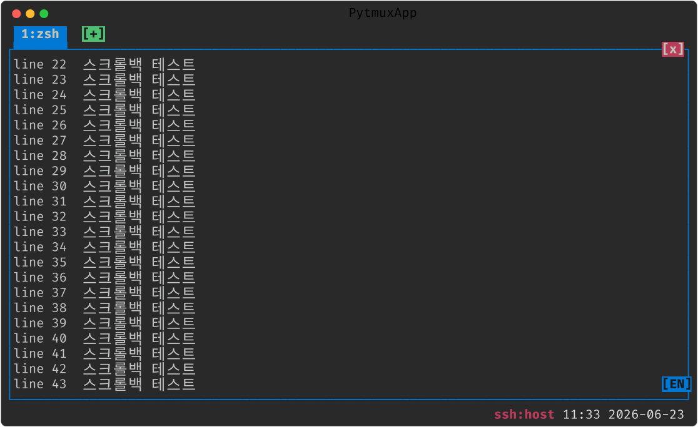

스크롤백 모드 키는 다음과 같습니다.

| 키 | 동작 |
|----|------|
| `↑` / `↓` | 한 줄 위/아래 |
| `PageUp` / `PageDown` | 한 화면 위/아래 |
| `g` / `G` | 맨 위 / 맨 아래 |
| `q` | 스크롤백 모드 종료 |

복사 모드 키 스타일은 설정 `set mode-keys vi|emacs` 로 바꾸실 수 있습니다.

---

## 8. 마우스로 거의 다 하기

| 동작 | 결과 |
|------|------|
| 패널 클릭 | 해당 패널로 포커스 이동 |
| 경계선 드래그 | 패널 크기 조절 |
| 패널 Shift+드래그 | 두 패널 위치 swap(교환) |
| 휠 위/아래 | 커서가 올라간 패널 스크롤백 |
| 우클릭 | 컨텍스트 메뉴 |
| 상단 탭바 탭 / `[+]` / `◀▶` | 탭 전환 / (마지막 탭 오른쪽)새 탭 / 가로 스크롤 |
| 탭바에서 탭 드래그 | 탭 재정렬 |
| 콘텐츠 오른쪽 위 `[x]` | 현재 탭 닫기(확인 팝업) |
| 하단 바 시계 / 날짜 클릭 | 시계 모드 / 이번 달 달력 오버레이 토글 |
| 하단 바 REC / 토큰 / 서버이름 클릭 | 통합 정보 팝업 |
| Claude 헤더 / 토큰 사용량 클릭 | 프롬프트 히스토리 / Claude 사용량 트리 팝업 |
| Claude 권한모드 footer 클릭 | 권한모드 선택 팝업(auto/default/plan) |

> 일부 터미널(iTerm2 등)이 alt-screen 에서 휠을 화살표로 바꿔 스크롤백이 안 열릴 때가
> 있습니다. 그때는 `set alt-scroll on`(기본) 으로 pytmux 가 휠을 직접 처리하게 두세요.

---

## 9. 메뉴와 명령 프롬프트

### 9.1 메뉴 (`prefix Enter` 또는 우클릭)

단축키를 외우지 않아도 메뉴로 거의 모든 동작을 하실 수 있습니다. 방향키로 선택하고
Enter 로 실행합니다(첫 항목이 파란색으로 하이라이트). 마우스 클릭도 됩니다.

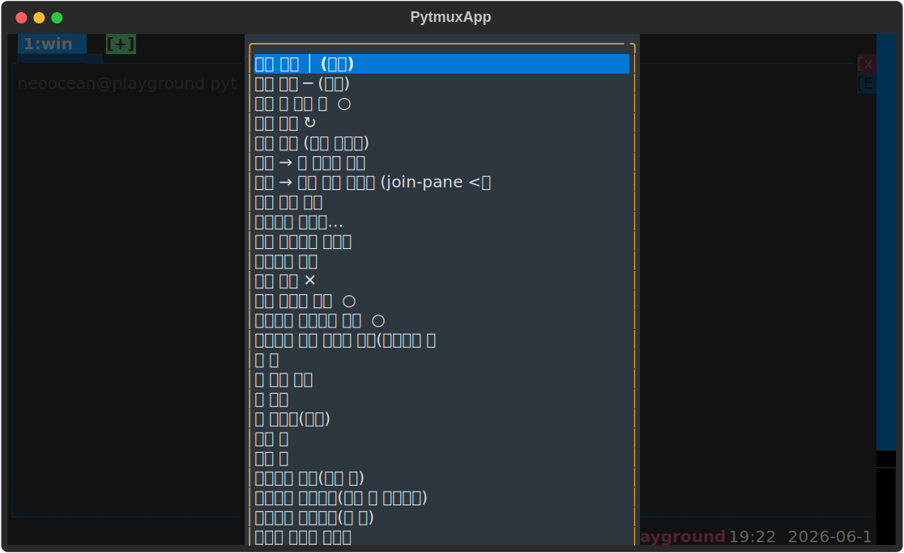

### 9.2 명령 프롬프트 (`ESC` → `:`, 또는 `prefix :`, 또는 `F12`)

바닥에 입력창(모달)이 열립니다. 맨 왼쪽에 고정 `:` 프리픽스가 표시되고(백스페이스로
지워지지 않습니다) 그 뒤에 tmux 와 비슷한 명령을 입력합니다.

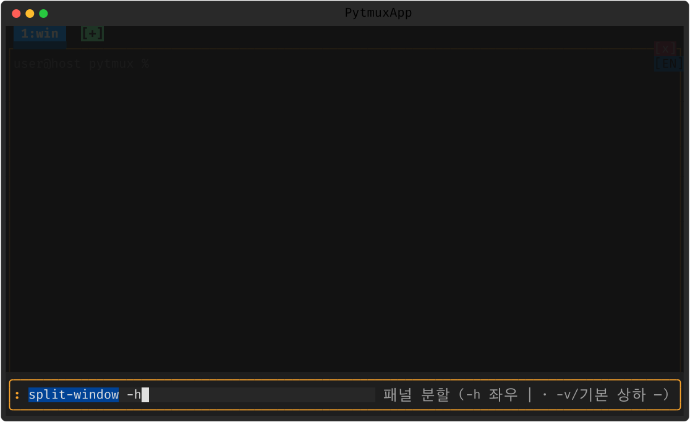

입력 중 도우미는 다음과 같습니다.

- **`?`** 또는 **`help`**(`commands`) — **명령 목록 팝업**을 엽니다(아래 [§9.3](#93-명령-팝업-명령-목록)).
- **자동완성** — 타이핑하면 회색 고스트로 미리보기(자주 쓰는 옵션 `-h` 등까지 제안),
  **오른쪽 화살표(→)** 로 수락합니다.
- **명령어/인자 구분** — 첫 토큰(명령어)에 옅은 배경이 칠해져 인자와 한눈에 구분됩니다
  (예: `split-window` 만 강조, `-h` 는 평문).

예시는 다음과 같습니다.

```
new-tab                          # 새 탭(= new-window)
split-window -h                  # 좌우 분할(-v 는 상하)
kill-pane                        # 현재 패널 삭제
resize-pane -Z                   # 줌 토글
swap-pane -t 2                   # 2번 패널과 교환
rename-tab build                 # 탭 이름변경
select-tab 3                     # 3번 탭으로
detach                           # 앱만 떼기(셸 유지)
```

전체 명령은 [§17 명령 레퍼런스](#17-명령-레퍼런스)에 있습니다.

### 9.3 명령 팝업 (명령 목록)

명령 이름을 외우지 못해도, **카테고리별로 정리된 전체 명령 목록**을 팝업에서 찾아
바로 명령줄에 채울 수 있습니다.

**진입 방법** — 셋 중 아무거나:

- 명령 프롬프트(`prefix :` 또는 `ESC` → `:`)를 연 뒤 **`?`** 를 입력
- 명령 프롬프트에서 **`help`**(또는 `commands` / `list-commands`)를 입력하고 Enter
- `ESC` 명령 모드에서 곧바로 **`?`** — 프롬프트를 거치지 않고 바로 팝업이 열립니다

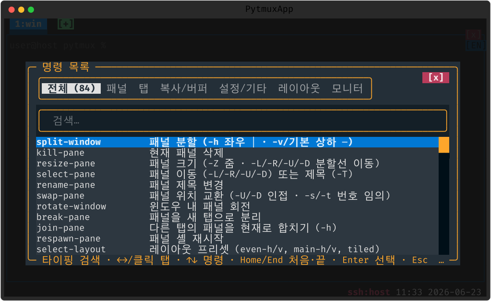

**구성과 사용 방법:**

- **카테고리 탭** — 명령이 많아 `패널` · `탭` · `복사/스크롤` · `레이아웃` · `모드` ·
  `Claude` · `설정/기타` 로 나뉘어 있습니다. **`←` `→`** 또는 **탭 클릭**으로 전환합니다.
  각 탭에는 (검색 중이면) 일치 개수가 함께 표시됩니다(예: `패널 (13)`).
- **검색** — 그냥 **타이핑**하면 상단 검색창에 들어가 즉시 필터링됩니다. 모든 탭에
  일치 개수가 갱신되어 **어느 카테고리에 결과가 있는지** 한눈에 보입니다. `Backspace`
  로 지웁니다.
- **이동** — **`↑` `↓`** 로 명령 사이를 오가고, **`Home`/`End`** 로 목록 처음·끝으로
  점프합니다. 목록이 길면 오른쪽 **스크롤바**가 표시됩니다.
- **선택** — **`Enter`** 를 누르면 그 명령이 **명령줄에 채워집니다**(팝업이 닫히고
  프롬프트로 돌아감). 이어서 인자를 더 입력한 뒤 다시 `Enter` 로 실행하거나, 인자가
  필요 없으면 곧바로 `Enter` 로 실행합니다.
- **닫기** — **`Esc`** 또는 오른쪽 위 **`[x]`** 클릭.

> 화면 하단의 안내줄(`타이핑 검색 · ←→/클릭 탭 · ↑↓ 명령 · Home/End 처음·끝 ·
> Enter 선택 · Esc 닫기`)에 이 조작이 항상 요약돼 있습니다.

### 9.4 디렉토리 트리 (`ncd`)

옛 Norton Utilities 의 **NCD(Norton Change Directory)** 처럼, **디렉토리 전용 트리**를
화면 가득 띄워 방향키·타이핑만으로 디렉토리를 골라 빠르게 이동합니다(파일은 안 보이고
디렉토리만 — 파일 매니저가 아니라 "디렉토리 바꾸기" 도구).

**열기** — 명령 프롬프트에서 **`ncd`**(별칭 `nc`). 인자 없이 바로 열립니다.

트리는 **드라이브 루트(`/`)부터 현재 패널의 디렉토리(cwd)까지 펼쳐진** 채 열리고,
**커서는 현재 디렉토리**에 놓입니다 — 지금 위치에서 시작해 위(부모)·아래(하위)·옆
(형제) 어디로든 갈 수 있습니다.


**조작:**

- **`↑` `↓`** — 이동.
- **`→`** — 접힌 디렉토리의 하위를 펼칩니다(필요할 때 서버에서 지연 로드).
- **`←`** — 펼쳐져 있으면 접고, 접혀 있으면 부모(상위)로 올라갑니다.
- **이름 타이핑(speed search)** — 디렉토리 이름 일부를 치면 현재 위치부터 그 이름으로
  시작하는(없으면 부분일치) 디렉토리로 **즉시 점프**합니다. 방향키를 누르면 검색어가
  초기화되고, `Backspace` 로 한 글자 지웁니다. 하단 안내줄에 `찾기: …` 로 보입니다.
- **`Enter`** — **현재 패널의 셸을 그 디렉토리로 `cd`** 하고 닫습니다(NCD 의 핵심).
- **`Shift+Enter`**(또는 **`Ctrl+O`**) — 그 디렉토리에서 시작하는 **새 패널을 분할**로
  엽니다(pytmux 확장). 터미널이 `Shift+Enter` 를 구분 못 하면 `Ctrl+O` 를 쓰세요.
- **`Esc`** — 아무 동작 없이 닫기.

> `Enter` 의 cd 는 대상 패널이 **셸 프롬프트** 상태일 때 의미가 있습니다(claude/vim
> 등이 실행 중이면 그 앱 입력으로 들어갑니다 — 실제 셸 cd 와 같은 한계).

---

## 10. 붙여넣기 · 클립보드 · 이미지

- **붙여넣기 패스스루** — 멀티라인 텍스트를 bracketed paste 로 그대로 전달합니다. 그래서
  Claude Code CLI 등에서 줄마다 실행되지 않고 한 번에 붙습니다.
- **이미지 붙여넣기** — 내부 프로그램이 공유 OS 클립보드에서 읽어 동일하게 동작합니다.
- 명령 `paste-clipboard` (= `Ctrl+V`) — OS 클립보드(텍스트/이미지) 붙여넣기.
- 명령 `send-escape` — 활성 패널에 ESC 전달(`Shift+ESC` 가 안 먹는 터미널용).

### Shift 조합 키 패스스루

`Shift+Enter`(줄바꿈 LF) · `Shift+Tab`(backtab/CSI Z) · `Shift+Escape`(ESC) 는 prefix
없이 **바로 활성 패널로 전달**됩니다. Claude Code 등에서 `Shift+Enter` 로 멀티라인 입력,
`Shift+Tab` 으로 권한/자동 모드 순환에 씁니다. (그냥 `Enter` 는 제출 CR, 그냥 `ESC` 는
명령 모드 진입이라 구분됩니다.)

---

## 11. Claude Code 연동

pytmux 는 패널에서 돌리는 **Claude Code CLI** 에 특화된 보조 기능이 많습니다. 아래는
**실제 Claude Code 가 pytmux 패널에서 도는 화면**입니다 — 패널에서 `claude` 를 실행하고
프롬프트를 보낸 뒤 응답이 끝난 모습입니다. 탭바의 상태 아이콘, 맨 윗줄(첫 라인)의 파란
**스티키 헤더**(보낸 프롬프트), 하단 상태줄의 **컨텍스트·토큰**이 모두 pytmux 가 Claude
Code 출력을 읽어 자동으로 채운 것입니다. (아래 §11.1~§11.5 의 스크린샷도 모두 실제
`claude` 를 패널에서 돌려 캡처한 것입니다.)


### 11.1 상태 아이콘

Claude Code 가 실행 중인 탭에 상태 아이콘을 표시합니다.

- `○` — 대기(입력 받을 준비)
- `◐` — 처리중
- `⊘` — 사용량 리밋으로 멈춤

아래 [§11.2](#112-스티키-프롬프트-헤더) 스크린샷의 탭바에서 처리중 아이콘 `◐` 가
`claude` 탭 앞에 붙은 모습을 보실 수 있습니다. 비활성 탭의 작업이 끝나면 **탭 배경색으로
완료를 알립니다**(그 탭을 보시면 해제됩니다).

### 11.2 스티키 프롬프트 헤더 (첫 줄)

Claude 패널의 **맨 윗줄(첫 라인)** 에, **지금 Claude Code 가 처리 중인 프롬프트**를 다른
색 **스티키 헤더**로 보여줍니다. 패널 내용을 아무리 스크롤해도 이 첫 줄은 **고정**되어
있어, 길게 도는 작업에서도 "무엇을 시키는 중인지" 를 항상 한눈에 알 수 있습니다. 큐에
대기 중인 프롬프트는 그 작업이 처리되기 시작할 때 헤더에 반영됩니다.

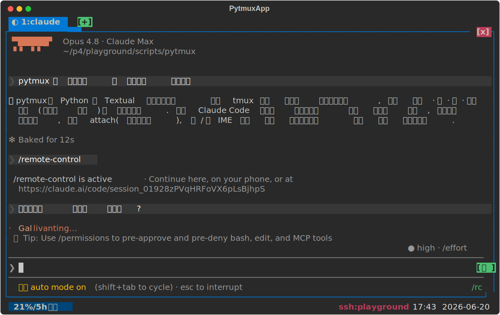

위 화면에서 맨 위의 파란 **첫 줄 헤더**(보낸 프롬프트), 탭바의 `◐ 1:claude`(처리중
아이콘), 하단 상태줄의 토큰(`… tok · Σ …`)을 한눈에 볼 수 있습니다. (실제 `claude` 를
처리 중인 상태라 스피너·`esc to interrupt` 가 함께 보입니다.)

- 직접 타이핑뿐 아니라 **붙여넣기(모바일 받아쓰기·자동완성 포함)로 입력한 프롬프트도**
  이 첫 줄에 반영됩니다.
- 표시 토글은 `claude-header on|off` 입니다.
- **첫 줄 헤더를 클릭**하면 **프롬프트 히스토리 팝업**이 열립니다 — 그 패널에서 시간순
  으로 입력한 프롬프트 목록을 보고(최신 항목이 강조), `[h]` 로 이 패널의 헤더 표시를
  켜고 끌 수 있습니다.

![프롬프트 히스토리 팝업 — 시간순 프롬프트 목록(최신 강조) + [h] 헤더 토글](image/20-prompt-history.svg)

### 11.3 토큰 사용량

활성 Claude 패널의 **모델·컨텍스트·토큰**을 상태줄 왼쪽에 표시합니다 — 예:
`opus-4.8 · ctx:10%/1M · Σ 25k (7% / 5h)`.

- `opus-4.8` — 현재 모델(배지에서 자동 인식).
- `ctx:10%/1M` — 컨텍스트 사용률 / 윈도우 크기. Claude 가 잔량%를 그리면 그 값을, 안
  그리면 세션 누계로 근사(`~`)합니다.
- `Σ 25k (7% / 5h)` — 계정 누적 토큰 + 5시간 한도 근접도. 5h % 는 **`/usage` 실측**
  (아래 [§11.8](#118-사용량-한도-조회-usage))이 있으면 그 값을, 없으면 설정 예산 기준
  근사입니다.

**상태줄의 이 토큰 영역을 클릭/터치**하면 **토큰 사용량 팝업**이 열립니다 — 마우스로
누르는 **서브탭(시간/일/주/월)** 으로 집계 단위를 바꾸고(키 `h/d/w/m` 도 동작), `계정`·
`/usage`·`시나리오` 버튼이 있습니다. 맨 위에는 `/usage` 로 확보한 **세션(5시간)·주간 한도
%와 리셋 시각**이 표시됩니다.

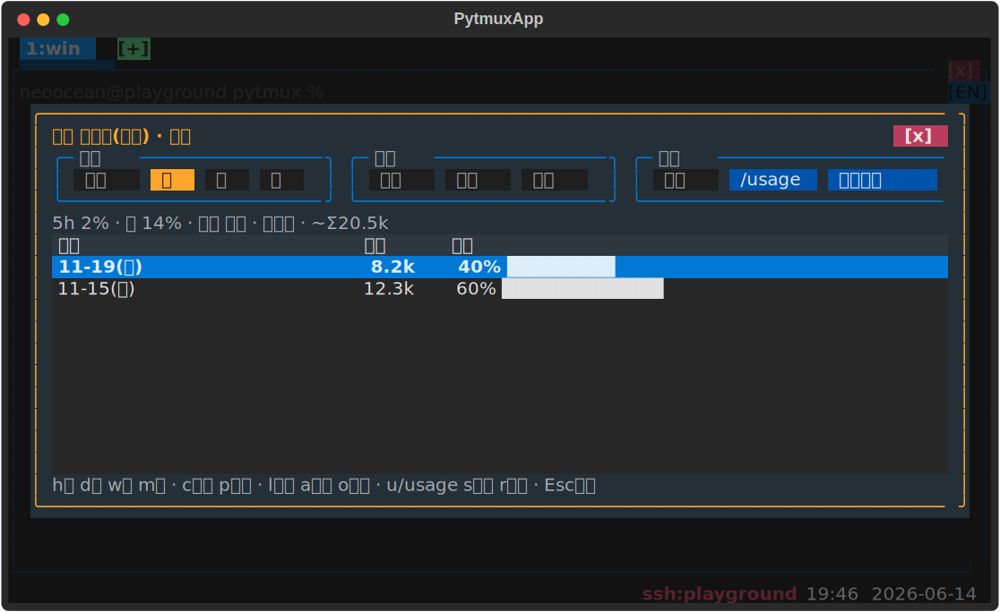

사용량은 세션 동안 유지·누적되며 `token-log` 로 파일에 영속 기록됩니다.

### 11.4 토큰 리밋 자동 재개

패널에서 돌리던 Claude Code 가 사용량 리밋에 걸려 멈추면, 출력에 표시된 **해제 시각을
읽어 그 시각이 되면 자동으로 재개 메시지를 입력**합니다.

- `prefix R` — 패널마다 켜고 끕니다. 켜진 패널은 상태줄 왼쪽에 주황색 `AR` 배지가 뜹니다.

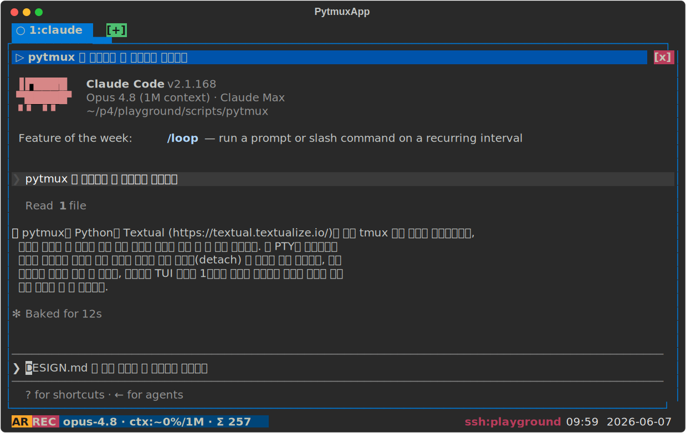

### 11.5 권한모드 연동

Claude Code 가 패널 하단에 그리는 권한모드 footer(`auto mode on …`)를 **클릭하면
권한모드 선택 팝업**이 열립니다(auto/default/plan 순환 주입).

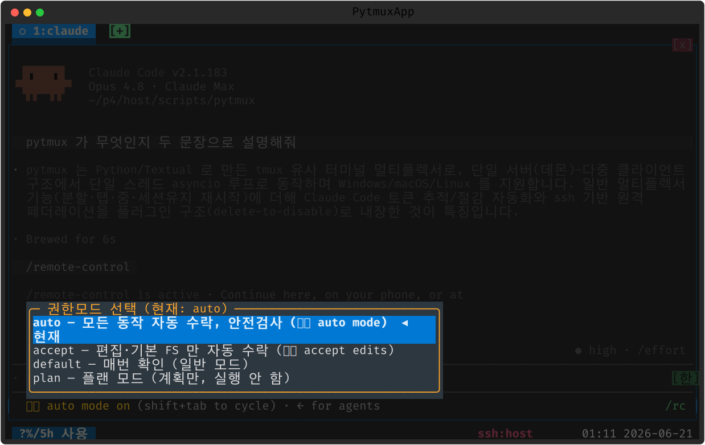

- `claude-auto-mode on` — idle 진입 시 자동으로 오토모드로 맞춥니다.

### 11.6 시작 규칙 / 자동 문서화-clear

- `claude-rules` — 시작 규칙을 편집해 두시면 새 세션이나 `/clear` 직후 첫 프롬프트에
  자동 주입됩니다.
- `auto-doc-clear on` — Claude 가 30초 이상 idle 일 때 진행상황을 문서화한 뒤 `/clear`
  를 자동 수행합니다.

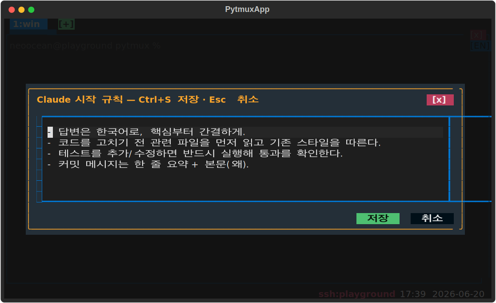

### 11.7 토큰 과사용 완화 설정 (`token-saver`)

`token-saver`(별칭 `claude-settings`)로 **토큰 절감 자동 개입 설정 팝업**을 엽니다. 각 행을
`Enter`(또는 클릭)로 토글/순환합니다. 모든 자동 개입은 **기본 OFF**(옵트인)입니다.

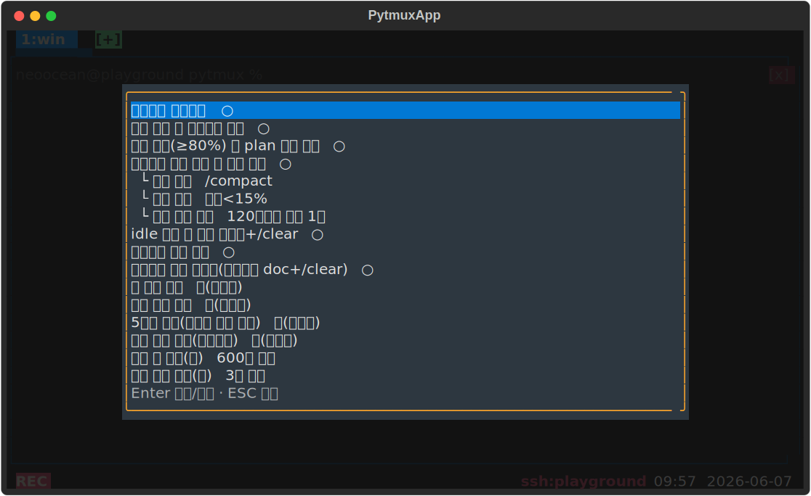

- **자동재개 / 예산 초과 시 재개 보류** — 리밋 해제 후 자동 `continue`, 예산 초과면 보류.
- **잔량 부족 시 자동 정리 / 정리 방식·임계·빈도 상한** — 컨텍스트 잔량이 임계 밑이면
  응답 완료 경계에서 `/compact`(또는 문서화→`/clear`)를 1회 수행.
- **일·세션·5시간·계정 합계 예산** — 누계가 예산의 80%/100% 도달 시 상태줄에 `⚠예산`
  경고. 계정 합계 예산을 넘으면 같은 계정 세션 중 **가장 꽉 찬 idle 부터** 정리합니다.
- **장기 턴 / 반복 루프 경고** — 한 턴이 너무 오래 돌거나(폭주 의심) 같은 출력이 반복되면
  (루프 의심) 상태줄에 `⚠` 배지로 알립니다(알림만, 자동 개입 없음).

또한 **PTY 밖 알림 훅**으로 자리를 비웠을 때도 알림을 받을 수 있습니다 — 예산/리밋/무장된
자동액션 시 `set-hook claude-budget-over 'run-shell …'` 등으로 데스크톱 알림·소리에
연결합니다(기본 미바인딩).

### 11.8 사용량 한도 조회 (`/usage`)

`claude-usage`(별칭 `usage`) 또는 토큰 팝업의 **`/usage` 버튼**으로, **사용자에게 안 보이는
숨은 Claude 세션**을 잠깐 띄워 `/usage` 패널을 읽어 **세션(5시간)·주간 한도 %와 리셋 시각**
을 가져옵니다(현재 화면엔 전혀 안 뜹니다). 결과는 토큰 팝업 맨 위와 상태줄 `5h` 표기에
실측값으로 반영됩니다.

### 11.9 원격 제어(Remote Control) 토글

Claude 데스크탑 앱 **원격 제어**로 연결된 패널은 화면에 `Remote Control active` 가
보입니다. 이 표시를 **클릭/터치**하면 정보 팝업이 열리고, 거기서 **`[r]`** 로 원격 제어를
켜고 끕니다(해당 패널에 `/rc` 슬래시 명령을 주입).

![원격 제어 팝업 — [r] 로 /rc 토글](image/25-remote-control.svg)

### 11.10 새 세션 자동 셋업 (`auto-launch`)

`auto-launch`(**기본 ON**)는 패널에서 Claude Code 가 **새로 시작될 때마다**(세션 시작
감지) 다음을 **세션당 1회** 자동 적용합니다.

- **`/rc` 주입** — 원격 제어(리모트 커넥션)를 켭니다. 화면에 이미 `Remote Control
  active` 가 보이면(재접속·재시작 복원 등) **건너뛰어** 켜진 원격 제어를 도로 끄지
  않습니다.
- **권한모드 `auto` 유도** — 첫 idle 에서 권한모드를 `auto`(자동 수락)로 한 번 맞춥니다
  (`shift+tab` 폐루프).

`claude-auto-mode`(§11.5)가 idle 마다 **상시** auto 로 강제하는 것과 달리, `auto-launch`
는 **세션 시작 1회**만 작동합니다 — 이후 사용자가 `shift+tab` 으로 바꾸면 다시 건드리지
않습니다. `/rc` 제출과 권한 `shift+tab` 은 입력 프레임을 갈라 한 묶음으로 섞이지 않게
보냅니다.

- `auto-launch off` 로 끄고 `auto-launch on` 으로 켭니다(기본 ON). 설정은 `opts.json`
  에 영속됩니다.

토큰 절약 시나리오 전반은 [TOKEN_SAVING_SCENARIO.md](TOKEN_SAVING_SCENARIO.md) 를
참고하세요.

---

## 12. 상태줄·시계·달력·정보 팝업

### 12.1 상태줄

하단 바에 탭 목록·줌 상태·시계가 표시됩니다(상단 탭바가 보이면 하단 탭 목록은 생략될 수
있습니다). **다중 줄 상태줄**도 설정으로 추가하실 수 있습니다. 색은 Textual
`textual-dark` 팔레트가 기본이며 `status-bg`/`status-fg` 로 바꿉니다.

포맷은 `status-left`/`status-right` 로 지정합니다(`#S` 세션, `#h` 짧은 호스트, `#H`
호스트, `#{pane_title}`, `%H:%M` 등 strftime).

### 12.2 시계 모드 / 달력

- `prefix t` 또는 하단 바 **시계 클릭** → **시계 모드**. 현재 패널을 **큰 블록-숫자
  시계**로 덮습니다(뒤 출력은 흐리게 계속 보입니다).


- 하단 바 **날짜 클릭** 또는 명령 `calendar-mode`/`cal` → **달력 오버레이**. 패널이
  충분히 크면 날짜가 **블록 문자**로 그려진 **큰 달력**이 되고, 오늘 날짜는 초록색으로
  강조됩니다(공간이 좁으면 일반 격자 또는 날짜 문자열로 자동 폴백).


멱등 켜기/끄기 명령은 `open-clock` / `close-clock` / `open-calendar` / `close-calendar`
입니다.

### 12.3 통합 정보 팝업

하단 상태줄의 **REC(캡처) · 토큰 · 서버 이름**을 클릭하면 탭으로 구분된 단일 팝업이
열립니다 — 캡처 경로 · 계정별 사용량 합계 · 서버 연결상태/RTT 를 `←→` 로 오가며 보실 수
있습니다.

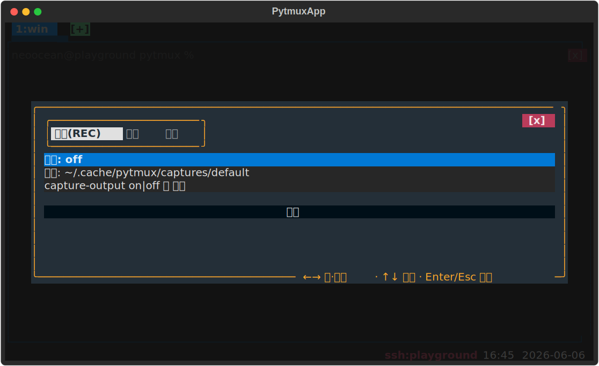

---

## 13. detach / attach 와 셸 영속성

- `prefix d` 또는 명령 `detach` — **앱만 떼어냅니다.** 셸과 실행 중 프로그램은 서버에서
  계속 돌아갑니다. 터미널 창을 닫아도 마찬가지입니다.
- 다시 `python3 pytmux.py` (또는 `pytmux`) — 같은 세션에 **attach** 해서 이어서
  작업하실 수 있습니다.

```sh
pytmux              # 서버 없으면 기동 후 attach, 있으면 attach
pytmux attach       # 명시적 attach
pytmux ls           # 탭/패널 요약 출력
pytmux kill-server  # 서버와 모든 탭/셸 종료
```

단일 세션 모델이라 세션 이름을 지정할 필요가 없습니다.

---

## 14. 네트워크 응답성과 재접속

클라이언트 ↔ 서버 IPC 지연이 커지면 패널 외곽선을 **빨간색**으로 표시(degraded)하고,
개선되면 원복합니다.

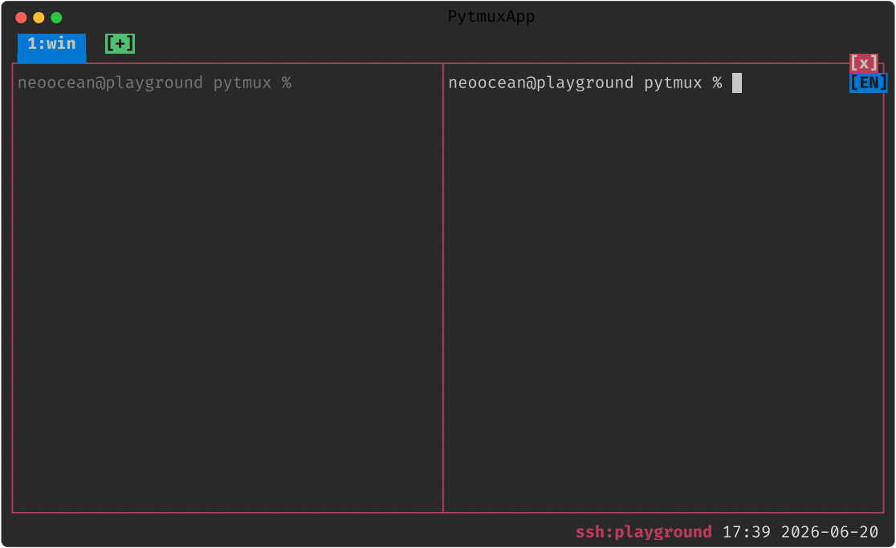

고착되면 `reconnect`(또는 `resync`, 또는 워치독 자동)으로 **실행 중 셸/Claude 를 죽이지
않고** IPC 만 다시 세워 반응성을 회복합니다. 성능 근거/로드맵은
[PERFORMANCE_SCENARIO.md](PERFORMANCE_SCENARIO.md) 를 참고하세요.

---

## 15. 작업 보존 서버 재시작

pytmux 는 활발히 개발 중이라 서버/클라이언트 코드가 자주 바뀝니다. 보통이라면 코드를
새로 반영하려면 서버를 죽이고 다시 띄워야 하는데, 그러면 **돌고 있던 셸·프로그램·
스크롤백이 모두 사라집니다.** 작업 보존 재시작은 **세션을 살린 채 코드만 새것으로**
바꿔 줍니다.

### 15.1 세 가지 재시작 명령

- **`restart-server`** — **서버만** 제자리에서 re-exec 합니다. 열린 패널의 **셸 · 실행 중
  프로그램 · 스크롤백을 그대로 살린 채 서버 코드만 새 이미지로 교체**합니다. 클라이언트는
  자동으로 다시 붙습니다. *서버 측 코드(`server.py`/`model.py`/…)를 갱신할 때.*
- **`restart-all`**(별칭 `full-restart`) — **서버 + 클라이언트 동시 재시작**입니다. 서버는
  위와 똑같이 세션을 보존한 채 코드만 교체하고, **클라이언트도 자기 자신을 새 코드로
  relaunch**(재실행)해 다시 attach 합니다. 즉 **서버·클라 양쪽 코드를 한 번에 갱신**하면서
  작업은 잃지 않는 "전체 업그레이드" 입니다. *클라 측 코드(`client.py`/`clientwidgets.py`/…)
  까지 같이 갱신할 때.*
- **`restart-check`**(별칭 `restart-dry-run`) — `restart-all` 을 **실제로는 하지 않고**
  안전한지만 점검해 **PASS/FAIL 팝업**으로 알려 줍니다(부작용 없음). 서버 re-exec 지원 ·
  복원할 세션 존재 · 상태 직렬화 round-trip · 모든 패널의 master fd 보유 · 클라 relaunch
  인자 해석을 확인하고, 실행 중 버전과 디스크 버전을 비교해 "재시작하면 새 코드가
  로드된다" 는 점도 함께 보여 줍니다.

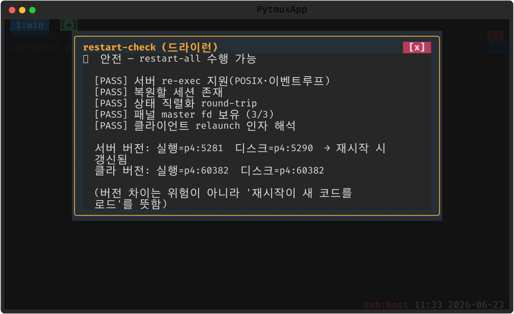

> 위 팝업의 "버전 차이"(실행 vs 디스크)는 위험 신호가 아니라 **재시작 시 새 코드가
> 로드된다는 뜻**입니다. 먼저 `restart-check` 로 PASS 를 확인한 뒤 `restart-all` 을
> 실행하면 안심하고 전체 업그레이드를 할 수 있습니다.

### 15.2 드라이런 FAIL 시 재시작 재확인

`restart-server`/`restart-all` 은 **실행 직전에 위 드라이런을 자동으로 한 번 돌립니다.**
모든 항목이 PASS 면 곧바로 재시작하지만, **하나라도 FAIL 이면 그대로 강행하지 않고**
어떤 점검이 실패했는지 보여 주며 **"그래도 재시작할까요?"** 를 다시 묻습니다. 작업을 잃을
수 있는 위험한 동작이라 기본 선택은 **취소**(붉은 강조)입니다. ←→ 로 이동 · Enter 확정 ·
`y`/`n` 단축 · Esc(=취소)로 닫습니다.

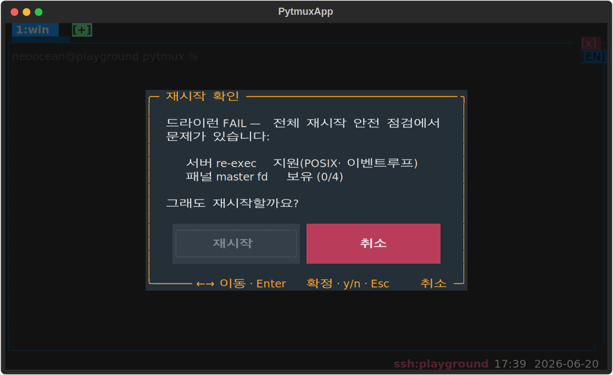

> FAIL 항목(예: `패널 master fd 보유 (0/4)`)은 그 상태로 재시작하면 해당 셸·실행 중
> 프로그램이 보존되지 않을 수 있다는 경고입니다. 확신이 없으면 **취소**를 고른 뒤
> `restart-check` 로 원인을 확인하세요.

설계/명세 전체는 [RESTART_SCENARIO.md](RESTART_SCENARIO.md) 를 참고하세요.

---

## 16. 설정 파일

`~/.config/pytmux/config`(또는 `~/.pytmux.conf`, 또는 `PYTMUX_CONFIG` 환경변수)를
읽습니다. 탐색 순서는 인자 경로 → `$PYTMUX_CONFIG` → `$XDG_CONFIG_HOME/pytmux/config`
→ `~/.config/pytmux/config` → `~/.pytmux.conf` 입니다. 예시는
[`pytmux.conf.example`](../pytmux.conf.example) 를 참고하세요.

```conf
# prefix 키 변경 (기본: Ctrl-b)
set prefix C-a

# 마우스 on/off
set mouse on

# 휠 스크롤백을 pytmux 가 처리(기본). 일부 터미널에서 스크롤백이 안 열릴 때 유지.
set alt-scroll on              # off = 터미널 기본 동작에 맡김

# 상단 탭바: always(기본)=탭 하나여도 표시 / auto=2개 이상일 때만
set tab-bar always

# 복사 모드 키 스타일: vi(기본) 또는 emacs
set mode-keys vi

# 새 탭/패널 시작 디렉토리: current(현재 패널)/home/<경로>
set default-path current

# 상태줄 색(미지정 시 textual-dark 테마)
# set status-bg green
# set status-fg black

# 상태줄 포맷(#S 세션, #h 짧은 호스트, #{pane_title}, strftime)
set status-left  " [#S] "
set status-right " #{pane_title}#h %H:%M %Y-%m-%d "

# prefix 후 키 바인딩: bind <key> <command...>
bind | split-window -h
bind - split-window -v
bind r rename-tab
bind k kill-pane
```

런타임에 설정 파일을 고치지 않고도 바인딩을 바꾸시려면 `bind-key`/`unbind-key`/`list-keys`
명령을 사용합니다([§17](#17-명령-레퍼런스)).

---

## 17. 명령 레퍼런스

명령 프롬프트(`prefix :`)나 외부 CLI(`pytmux cmd <명령>`)에서 사용합니다. 탭 명령은
tmux 의 윈도우 명령 이름과 별칭을 **둘 다** 받습니다.

### 패널

| 명령 | 동작 |
|------|------|
| `split-window -h` / `splitw -h` | 좌우 분할 (`-v` = 상하) |
| `kill-pane` / `killp` | 현재 패널 삭제 |
| `resize-pane -Z` | 줌 토글 |
| `swap-pane -t <n>` | n 번 패널과 교환 |
| `rotate-window` | 윈도우 내 패널 회전 |
| `pane-border on\|off` | 단일 패널 테두리 표시 토글 |

### 탭/윈도우

| 명령 | 동작 |
|------|------|
| `new-tab` / `new-window` / `newt` / `neww` | 새 탭 |
| `kill-tab` / `kill-window` | 탭 삭제 |
| `rename-tab <name>` / `rename-window <name>` | 탭 이름변경 |
| `select-tab <n>` / `select-window <n>` / `selectt` / `selectw` | n 번 탭 선택 |
| `next-tab` / `prev-tab` | 다음/이전 탭 |
| `move-tab -t <n>` / `move-tab-left\|right\|first\|last` | 탭 이동 |
| `swap-tab -t <n>` | 탭 교환 |
| `choose-tree` / `choose-tab` | 탭/패널 트리 선택기 |
| `ncd` (별칭 `nc`) | 디렉토리 트리(NCD)로 이동 — 아래 [§9.4](#94-디렉토리-트리-ncd) |

### 레이아웃

| 명령 | 동작 |
|------|------|
| `layout-save <name>` | 현재 탭 레이아웃 저장 |
| `layout-load [name]` | 저장 레이아웃을 현재 탭에 덮어쓰기(생략 시 선택기) |
| `layout-load-new <name>` | 저장 레이아웃을 새 탭으로 열기 |
| `next-layout` | 프리셋 레이아웃 순환 |

### UI / 오버레이

| 명령 | 동작 |
|------|------|
| `calendar-mode` / `cal` | 이번 달 달력 오버레이 토글 |
| `open-clock` / `close-clock` | 시계 모드 멱등 켜기/끄기 |
| `open-calendar` / `close-calendar` | 달력 멱등 켜기/끄기 |

### 클립보드

| 명령 | 동작 |
|------|------|
| `paste-clipboard` | OS 클립보드(텍스트/이미지) 붙여넣기 (= Ctrl+V) |
| `send-escape` | 활성 패널에 ESC 전달 |

### Claude

| 명령 | 동작 |
|------|------|
| `claude-header on\|off` | 스티키 헤더 표시 토글 |
| `token-log` | 토큰 사용량 파일 기록 |
| `claude-rules` | 시작 규칙 편집(새 세션/clear 후 자동 주입) |
| `claude-auto-mode on\|off` | idle 시 권한모드 자동 오토모드 전환 |
| `auto-launch on\|off` | 새 세션 시작 시 `/rc`(원격 제어)+권한 `auto` 1회 자동 적용(기본 ON) |
| `auto-doc-clear on\|off` | 30초 idle 시 자동 문서화 + `/clear` |

### 키 바인딩 / 진단 / 운영

| 명령 | 동작 |
|------|------|
| `bind-key <키> <명령>` / `unbind-key <키>` / `list-keys` | 런타임 키 바인딩 |
| `capture-output on\|off` | 패널 출력 캡처(진단) 토글 |
| `reconnect` / `resync` | IPC 강제 재접속(degraded 회복, 서버 보존) |
| `restart-server` | 작업 보존 재시작(셸/PTY 유지, 서버 코드만 교체) |
| `restart-all` / `restart-check` | 세션유지 재시작 + 클라 relaunch / 그 드라이런 |
| `version` | 클라/서버 버전(p4 CL)·업타임 팝업 |
| `detach` | 앱만 떼기(셸 유지) |
| `kill-server` | 서버와 모든 탭/셸 종료 |
| `help` / `commands` / `?` | 전체 명령 목록 |

---

## 18. 키 바인딩 레퍼런스

prefix 기본값은 `Ctrl-b` 입니다 (설정 `set prefix C-a` 등으로 변경 가능).

| 키 | 동작 | 키 | 동작 |
|----|------|----|------|
| `prefix %` | 좌우 분할 | `prefix "` | 상하 분할 |
| `prefix x` | 패널 삭제(확인) | `prefix z` | 패널 줌 토글 |
| `prefix o` | 다음 패널 | `prefix ←↑↓→` | 패널 이동 |
| `prefix H/J/K/L` | 패널 경계 이동 | `prefix c` | 새 탭 |
| `prefix ,` | 탭 이름변경 | `prefix &` | 탭 삭제(확인) |
| `prefix .` | 탭 이동(인덱스) | `prefix :` | 명령 입력 |
| `prefix n` / `p` | 다음/이전 탭 | `prefix 1-9` | 탭 선택(1번부터) |
| `prefix d` | detach(셸 유지) | `prefix [` | 스크롤백 모드 |
| `prefix t` | 시계 모드 | `prefix l` | 직전 탭 |
| `prefix Enter` | 메뉴 열기 | `prefix R` | 토큰리밋 자동재개 토글 |
| `ESC` | 명령 모드 | `F12` | 명령 프롬프트 바로 열기 |
| `prefix F12` | 중첩 시 prefix 패스스루 토글 | | |

- `ESC` 명령 모드: `←↑↓→` 패널 이동, 위 방향키로 탭바 포커스, `h` Claude 헤더 포커스,
  `:` 명령 프롬프트.
- 스크롤백 모드(`prefix [`): `↑/↓`, `PageUp/PageDown`, `g`/`G`, `q` 종료.
- Shift 조합(`Shift+Enter`/`Shift+Tab`/`Shift+Escape`)은 prefix 없이 활성 패널로
  전달됩니다.
- 한글 IME 가 켜져 있어도 단축키가 동작합니다(두벌식 자모를 QWERTY 키로 자동 변환).

---

## 19. 외부에서 서버 제어 (CLI)

앱 안에 들어가지 않고도 셸에서 서버를 제어하실 수 있습니다.

```sh
pytmux                            # attach (없으면 기동)
pytmux attach                     # 실행 중 서버에 attach
pytmux ls                         # 탭/패널 요약
pytmux kill-server                # 서버와 모든 탭/셸 종료
pytmux cmd new-tab                # 외부에서 명령 실행
pytmux cmd split-window -h        # (명령 프롬프트와 동일한 구문)
pytmux --socket PATH …            # 사용할 소켓 경로 직접 지정
```

### 렌더 진단 (화면 없이)

프로그램 출력을 녹화한 뒤 텍스트 프레임으로 재생해 렌더링을 점검합니다.

```sh
# 옵션은 파일명 앞, 실행할 명령은 -- 뒤
python3 pytmux.py record --cols 120 cap.raw -- ls -C
python3 pytmux.py replay --cols 120 cap.raw --ruler   # 텍스트로 덤프(+열 자)
```

---

## 20. 문제 해결 FAQ

**Q. 휠을 굴려도 스크롤백이 안 보입니다.**
A. 일부 터미널(iTerm2 등)이 alt-screen 에서 휠을 화살표로 바꿉니다. `set alt-scroll on`
(기본) 으로 두면 pytmux 가 휠을 직접 처리합니다. 그래도 안 되면 `prefix [` 로 스크롤백
모드에 들어가 키보드로 보세요.

**Q. 패널 외곽선이 빨갛습니다.**
A. 클라↔서버 IPC 지연이 크다는 표시(degraded)입니다. 보통 자동으로 회복되며, 고착되면
`reconnect` 를 실행하세요. 셸/Claude 는 죽지 않습니다([§14](#14-네트워크-응답성과-재접속)).

**Q. 앱을 닫았는데 셸이 살아 있나요?**
A. 그렇습니다. 서버가 PTY 를 보유하므로 detach/창 닫기로 셸은 죽지 않습니다. 다시
`pytmux` 하면 이어서 붙습니다. 정말 다 끝내시려면 `kill-server` 를 쓰세요
([§13](#13-detach--attach-와-셸-영속성)).

**Q. `prefix H/J/K/L`(패널 크기)이 한글 입력 중엔 안 먹습니다.**
A. 두벌식에서 시프트 구분이 안 되기 때문입니다. 마우스 경계 드래그를 쓰거나 영문 입력
상태에서 누르세요([§5.3](#53-크기-조절)).

**Q. 중첩(ssh 안에서 또 pytmux)인데 prefix 가 충돌합니다.**
A. `prefix F12` 로 prefix 패스스루를 토글해 안쪽 인스턴스로 prefix 를 흘려보내세요.

**Q. 명령 이름이 기억나지 않습니다.**
A. 명령 프롬프트에서 `?` 또는 `help` 를 누르면 전체 목록을 방향키로 고를 수 있고,
타이핑하면 회색 고스트 자동완성이 뜹니다([§9.2](#92-명령-프롬프트-esc---prefix--또는-f12)).

---

*문서: `docs/MANUAL.md` — pytmux 상세 사용 매뉴얼. 요약은 [README](../README.md),
설계는 [DESIGN.md](DESIGN.md), 기능 현황은 [FEATURES.md](FEATURES.md) 를 참고하세요.*
