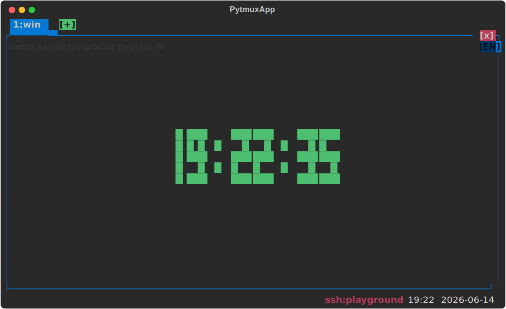
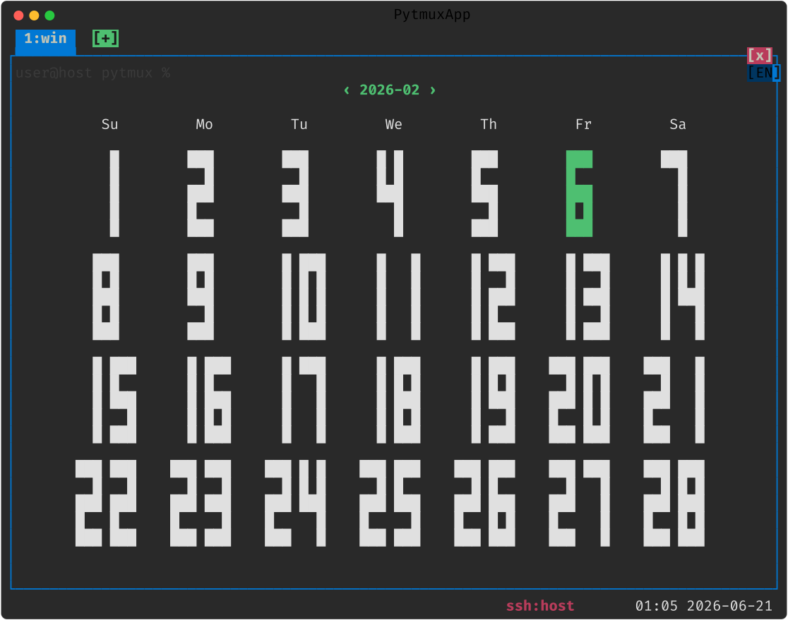
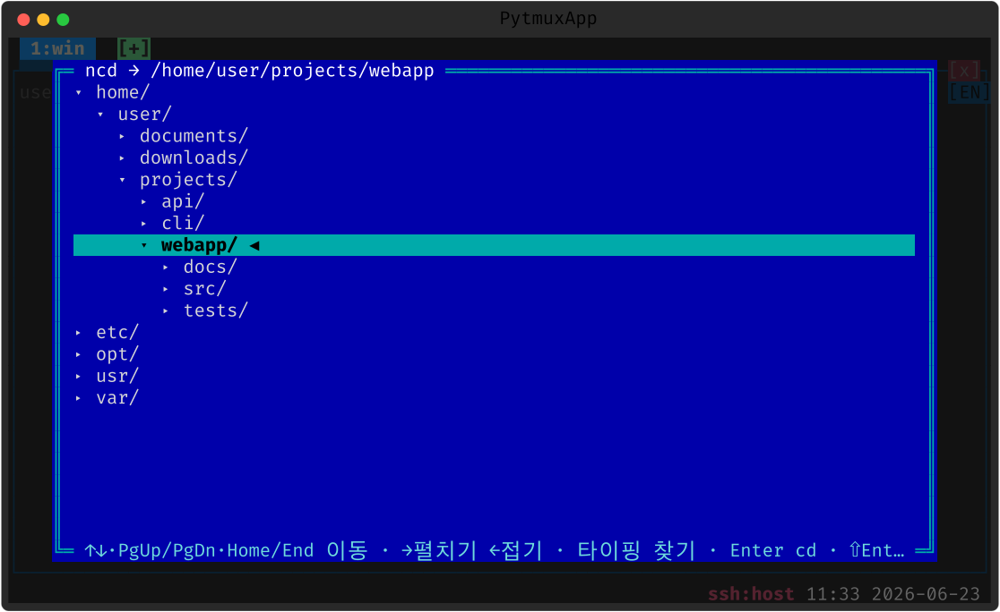
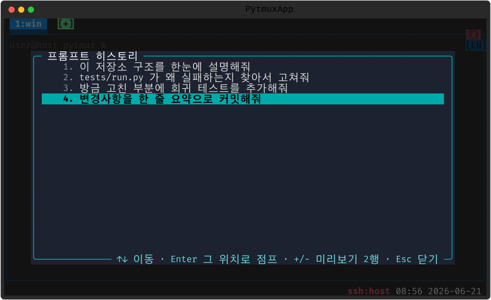
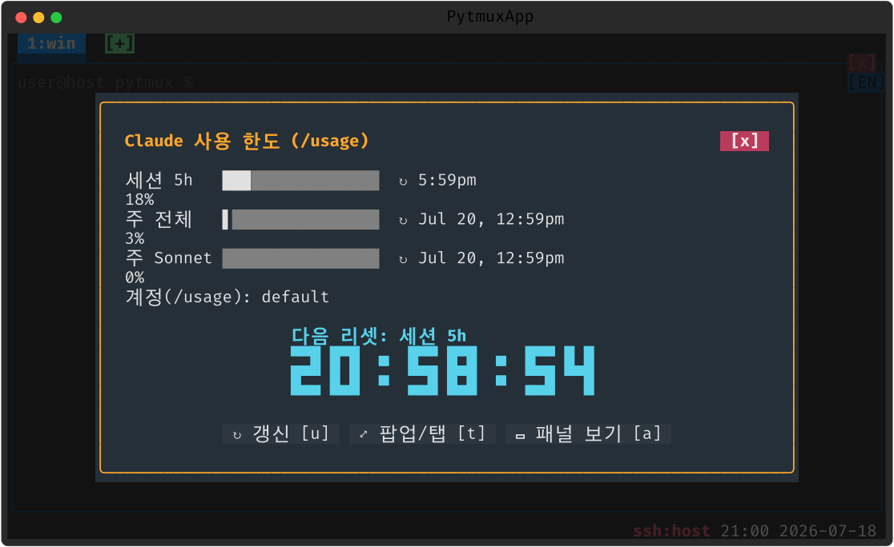
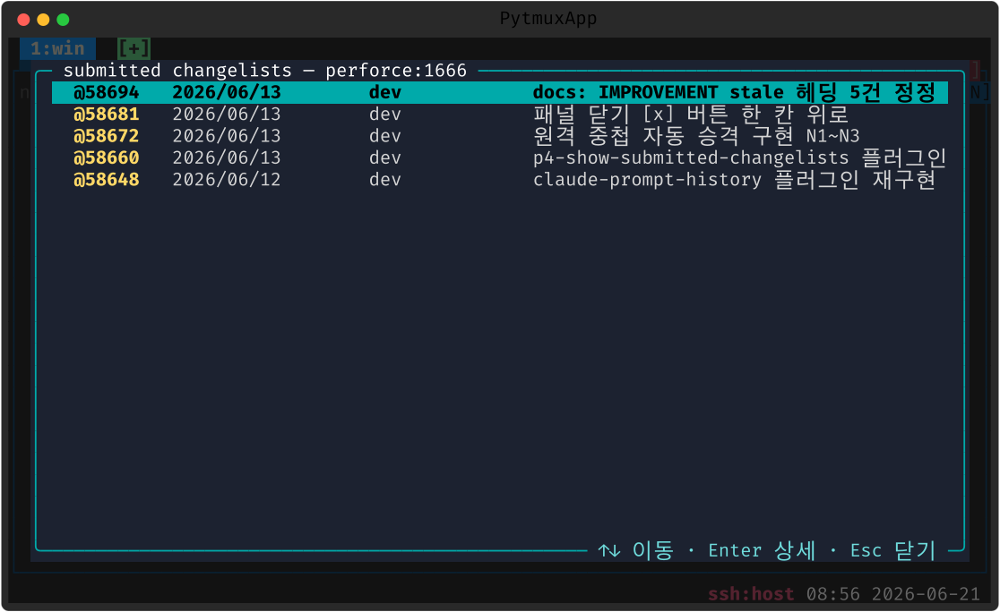
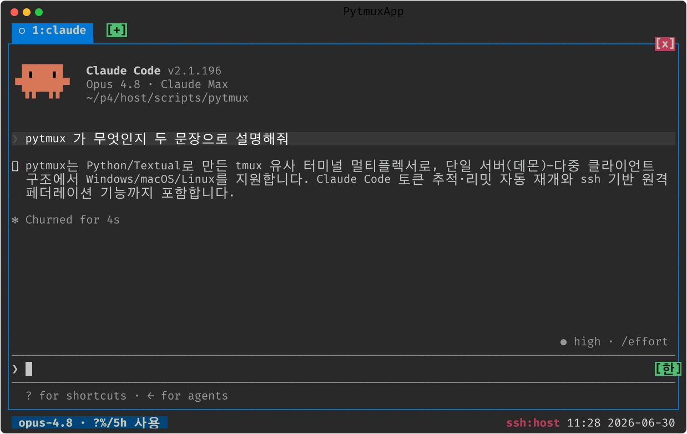

# pytmux 플러그인 매뉴얼 — 사양 · 작성법 · 사례

이 문서는 **pytmux 플러그인을 직접 만들려는 분**을 위한 실무 매뉴얼입니다. 플러그인이
무엇인지, `PLUGIN` 객체가 노출할 수 있는 **계약(훅)** 전체, 한 디렉토리만 지우면 기능이
조용히 사라지는 **delete-to-disable** 원칙, 그리고 두 개의 완성된 레퍼런스 플러그인
(**시계 `clock`**, **달력 `calendar`**)을 **실제 화면 스크린샷**과 함께 단계별로 설명합니다.

> - 사용자용 전체 매뉴얼은 [MANUAL.md](MANUAL.md) 를 참고하세요.
> - 스크린샷은 모두 `scripts/gen_screenshots.py` 가 **실제 클라이언트를 헤드리스로 운전**해
>   생성합니다.

---

## 목차

1. [플러그인이란 무엇인가](#1-플러그인이란-무엇인가)
2. [핵심 원칙: delete-to-disable](#2-핵심-원칙-delete-to-disable)
3. [디렉토리 구조와 로딩](#3-디렉토리-구조와-로딩)
4. [플러그인 계약 레퍼런스 (모든 훅)](#4-플러그인-계약-레퍼런스)
5. [작성법: 빈 디렉토리에서 시작하기](#5-작성법-빈-디렉토리에서-시작하기)
6. [사례 1 — 시계 플러그인 `clock`](#6-사례-1--시계-플러그인-clock)
7. [사례 2 — 달력 플러그인 `calendar`](#7-사례-2--달력-플러그인-calendar)
8. [사례 3 — ncd 플러그인 `ncd`](#8-사례-3--ncd-플러그인-ncd)
9. [사례 4 — `claude-prompt-history`](#9-사례-4--claude-prompt-history)
10. [사례 5 — `claude-token-usage-view`](#10-사례-5--claude-token-usage-view)
11. [사례 6 — `ime-indicator`](#11-사례-6--ime-indicator)
12. [사례 7 — `p4-show-submitted-changelists`](#12-사례-7--p4-show-submitted-changelists)
13. [사례 8 — `claude-code` (개요)](#13-사례-8--claude-code-개요)
14. [무게 규칙: 서버도 같은 코드를 읽는다](#14-무게-규칙-서버도-같은-코드를-읽는다)
15. [테스트와 계약 검증](#15-테스트와-계약-검증)
16. [체크리스트와 함정](#16-체크리스트와-함정)

---

## 1. 플러그인이란 무엇인가

pytmux 플러그인은 `pytmuxlib/plugins/<name>/` 하위의 **서브패키지**(디렉토리 + `__init__.py`)
하나입니다. 거대하거나 선택적인 기능을 코어에서 떼어내 **한 디렉토리에 응집**시키고,
명령·자동완성·디스패치·서버 로직·패널 오버레이를 **레지스트리를 통해서만** 코어에 합칩니다.

핵심은 **코어가 플러그인을 하드 참조하지 않는다**는 것입니다. `client.py`/`server.py`/
`serverio.py` 같은 코어 모듈은 플러그인을 직접 `import` 하지 않고, 명령 이름·메시지 타입·
서버 액션·오버레이 그리기를 **레지스트리(`plugins.Registry`)** 에 위임합니다. 그래서
플러그인이 없으면 그 경로는 **에러 없이 no-op** 이 됩니다.

지금 저장소에 있는 플러그인(8개 — 화면은 [GALLERY.md](GALLERY.md) §7 참고):

| 플러그인 | 무엇 | 축 | 규모 | 사례 |
|---------|------|----|------|------|
| `clock` | 패널을 큰 블록 시계로 덮는 오버레이 | 클라 오버레이 | 작음(레퍼런스) | [§6](#6-사례-1--시계-플러그인-clock) |
| `calendar` | 패널을 이번 달 달력으로 덮는 오버레이 | 클라 오버레이 | 작음(`clock` 미러) | [§7](#7-사례-2--달력-플러그인-calendar) |
| `ncd` | Norton Change Directory 풍 디렉토리 트리 | 모달 + 서버 왕복 | 중간 | [§8](#8-사례-3--ncd-플러그인-ncd) |
| `claude-prompt-history` | Claude 프롬프트 히스토리(미리보기·팝업·점프) | 서버 입력 훅 + 모달 | 중간 | [§9](#9-사례-4--claude-prompt-history) |
| `claude-token-usage-view` | 사용 한도 막대 + 리셋 카운트다운 화면 | status 흡수 + 모달 | 작음 | [§10](#10-사례-5--claude-token-usage-view) |
| `ime-indicator` | 우상단 IME(한/영) 상태 배지 | 키 관찰 + 렌더 | 작음 | [§11](#11-사례-6--ime-indicator) |
| `p4-show-submitted-changelists` | 퍼포스 submitted CL 목록 풀스크린 | 모달 + 서버 왕복 | 중간 | [§12](#12-사례-7--p4-show-submitted-changelists) |
| `claude-code` | Claude Code 통합(스캔·상태·토큰·렌더 전체) | 모든 축(server_mixin 포함) | 큼(ncd 의 ~10배) | [§13](#13-사례-8--claude-code-개요) |

`clock`/`calendar` 는 **작고 자족적**이라 새 플러그인을 만들 때 베끼기 가장 좋은 출발점입니다.
각 플러그인이 어느 **축**(클라 오버레이 / 모달 화면 / 서버 왕복 / status 흡수 / 키·렌더 훅 /
서버 믹스인)을 쓰는지는 위 표의 "축" 열로 가늠하세요 — 사례 §6~§13 이 축별 본보기입니다.

---

## 2. 핵심 원칙: delete-to-disable

> **디렉토리를 통째로 지우면 그 기능은 명령 검색·자동완성·디스패치·렌더 어디에도 나타나지
> 않고 조용히 비활성화된다.**

이것이 플러그인 시스템의 단 하나의 불변식입니다. 새 플러그인을 만들 때 항상 자문하세요 —
**"이 디렉토리를 `rm -rf` 하면 코어가 깨지나?"** 깨진다면 그건 코어가 플러그인을 직접
참조한다는 뜻이고, 계약 위반입니다.

이를 가능하게 하는 두 가지 코어 측 규율:

1. **코어는 레지스트리 훅으로만 닿는다.** 예: 시계 오버레이를 그릴 때 코어는
   `self.plugins.client_overlay(...)` 만 부르지, `from .plugins.clock import ...` 하지 않습니다.
   플러그인이 없으면 훅이 빈 루프를 돌아 no-op 입니다.
2. **인스턴스 글루는 `getattr` 가드로 읽는다.** 플러그인이 `attach_client` 에서
   `app.toggle_clock` 같은 메서드를 설치하면, 코어는 `getattr(app, "toggle_clock", None)`
   으로 부드럽게 부릅니다. 없으면 `None` → 클릭/키가 조용히 무시됩니다.

`clock/__init__.py` 의 모듈 docstring 이 이 계약을 그대로 적어 둡니다:

```text
디렉토리를 통째로 지우면 clock-mode/open-clock/close-clock 명령은 검색·자동완성·
디스패치 어디에도 잡히지 않고, 상태줄 시각 클릭·ESC 동선의 'clock' 버튼·prefix `t` 키는
조용히 no-op 이 된다 — 코어가 toggle_clock 을 getattr 로만 부르고, 오버레이 그리기/
1초 틱/닫기는 plugins 레지스트리 훅(client_overlay/client_tick/client_close_overlay)으로만
닿기 때문이다.
```

### 2.1 지우지 않고 끄기 — 플러그인 관리 팝업

디렉토리 삭제는 **영구·비가역**적인 비활성화입니다. 같은 효과를 **가역적**으로 얻으려면
`:plugins`(별칭 `plugin-manager`) 명령으로 **플러그인 관리 팝업**을 열어 플러그인을
Space/Enter 토글로 끄면 됩니다. 끈 상태는 `opts.json` 의 `disabled_plugins` 에 영속되고,
서버가 새 비활성 집합을 전 클라에 방송해 명령·자동완성·훅이 **즉시** 빠집니다. 같은
팝업에서 다시 켜면 돌아옵니다.

팝업이 나열하는 각 항목의 이름·설명은 `PLUGIN` 객체의 `name`/`description`(있으면) 에서
오므로, 새 플러그인에는 한 줄 `description` 을 달아 두는 것이 좋습니다(없으면 이름만 표시).

> **서버 믹스인 기여 플러그인의 한 가지 예외**: `claude-code`·`rec` 처럼 `server_mixin()`
> 으로 서버측 클래스를 합성하는 플러그인은, 그 메서드가 import 시 이미 `Server` 에 합성돼
> 있어 런타임 토글로는 **메서드 자체가 빠지지 않습니다**. 토글은 그 동작을 구동하는 훅
> (`server_scan` 등)이 안 불려 무동작이 되게 하는 방식이고, 메서드까지 완전히 빼려면 서버
> 재시작이 필요합니다.

---

## 3. 디렉토리 구조와 로딩

### 3.1 구조

```
pytmuxlib/plugins/
├── __init__.py          # 로더 + Registry (코어가 부르는 유일한 진입점)
├── clock/
│   ├── __init__.py      # PLUGIN 객체 + 계약(명령·훅)
│   └── render.py        # 무거운 그리기 로직(지연 import 됨)
├── calendar/
│   ├── __init__.py
│   └── render.py
├── ncd/ …
└── claude-code/ …
```

각 플러그인의 `__init__.py` 는 **모듈 레벨 변수 `PLUGIN`** 을 노출해야 합니다. 로더는 이
객체만 봅니다.

### 3.2 로딩 (`plugins/__init__.py`)

`load()` → `Registry`. 동작:

- `pkgutil.iter_modules` 로 하위 **서브패키지**(디렉토리 + `__init__.py`)를 찾아
  `importlib.import_module` 로 불러옵니다.
- 각 모듈의 `PLUGIN` 객체를 모읍니다.
- **import 가 깨진 플러그인은 조용히 건너뜁니다** — 하나가 망가져도 앱 전체를 막지 않습니다.

```python
def _discover():
    found = []
    for info in pkgutil.iter_modules(__path__):
        if not info.ispkg:
            continue
        try:
            mod = importlib.import_module(f"{__name__}.{info.name}")
        except Exception:
            continue                      # 깨진 플러그인은 건너뛴다
        plugin = getattr(mod, "PLUGIN", None)
        if plugin is not None:
            found.append(plugin)
    return found
```

클라이언트(`PytmuxApp.__init__`)와 서버(`Server.__init__`) **양쪽**이 `plugins.load()` 를
호출해 `self.plugins` 로 보관합니다. 즉 **같은 플러그인 코드가 두 프로세스에서 import**
됩니다 — [§14 무게 규칙](#14-무게-규칙-서버도-같은-코드를-읽는다)이 여기서 나옵니다.

### 3.3 하이픈 디렉토리명

`claude-code` 처럼 하이픈이 든 이름도 됩니다. `importlib.import_module("...claude-code")`
와 **패키지 내부 상대 import**(`from .screens import X`)는 하이픈과 무관하게 동작합니다.
단 **외부 절대 import 문**(`from pytmuxlib.plugins.claude-code import ...`)은 파이썬 문법
오류이므로, 테스트 등 외부에서는 `importlib.import_module(...)` 로 가져와야 합니다.

---

## 4. 플러그인 계약 레퍼런스

`PLUGIN` 객체가 노출할 수 있는 모든 멤버입니다. **전부 선택적**입니다(덕 타이핑 —
`getattr` 로 읽고 없으면 빈 값/no-op). 필요한 것만 구현하세요.

### 4.1 명령 메타데이터 (속성)

코어의 `COMMANDS`/`COMPLETIONS`/`COMMAND_NOARG`/`COMMAND_OPTIONS`/`PANE_SCOPED_CMDS`
에 병합되어 명령 프롬프트 `?` 목록·팔레트·자동완성에 나타납니다.

| 멤버 | 타입 | 의미 |
|------|------|------|
| `commands` | `list[(name, desc, category)]` | `?` 목록/팔레트·자동완성에 등록될 명령들 |
| `noarg` | `set[str]` | 인자 없이 즉시 실행해도 되는 명령(팔레트 선택 즉시 실행) |
| `completions` | `list[str]` | 자동완성 추가 후보(명령 이름은 레지스트리가 자동 추가) |
| `command_options` | `dict` | 팔레트 옵션(선택지) 스키마 |
| `pane_scoped` | `set[str]` | 활성 패널에 적용되는 명령(프롬프트 작성 중 대상 패널을 밝게 표시) |

> 레지스트리는 `completions` 에 **명령 이름도 자동으로** 더합니다 — `commands` 의 각
> `name` 이 자동완성 후보가 되므로, `completions` 에는 *추가* 옵션 템플릿만 넣으면 됩니다
> (시계/달력은 빈 리스트입니다).

### 4.2 클라이언트 훅 (메서드)

| 훅 | 시그니처 | 언제 호출 |
|----|---------|----------|
| `attach_client` | `(app)` | 앱 인스턴스마다 **1회** — 인스턴스 글루(`app.toggle_clock` 등) 설치 |
| `handle_command` | `(app, c, args) -> bool` | 명령 `c` 를 처리했으면 `True`(코어 `_run_command` 폴백) |
| `handle_message` | `(app, msg) -> bool` | 서버 메시지(`t`)를 처리했으면 `True`(코어 `_dispatch` else) |
| `client_overlay` | `(app, cells, W, H, active)` | 패널 전체를 덮는 오버레이를 `cells` 에 그림(in-place) |
| `client_tick` | `(app) -> bool` | 1초 틱 — 갱신이 필요하면 `True`(코어가 재합성) |
| `client_close_overlay` | `(app, pane_id) -> bool` | 패널 오버레이 닫기(Shift+ESC/클릭) — 닫았으면 `True` |
| `client_render` | `(app, cells, W, H)` | 콘텐츠-레이어 장식(스티키 헤더·클릭존 스캔 등) |
| `client_status` | `(app, msg)` | status 메시지의 플러그인-소유 필드를 흡수 |
| `client_statusbar_update` | `(app, status, msg)` | 하단 상태줄 위젯에 필드 흡수 |
| `client_statusbar` | `(app, status, segs, w)` | 상태줄 좌측 세그먼트 append + 클릭존 채우기 |
| `client_status_tabs` | `(app, tree) -> list[(title, lines)]` | 통합 상태 팝업에 탭 기여 |

시계/달력은 이 중 **`attach_client`·`handle_command`·`client_overlay`·`client_tick`·
`client_close_overlay`** 다섯만 씁니다. 나머지(`client_render`/`client_status*`/
`client_status_tabs`)는 대형 `claude-code` 가 헤더·상태줄·토큰 탭을 코어에서 떼어내려고
쓰는 고급 훅입니다.

### 4.3 서버 훅 (메서드)

서버 프로세스도 `plugins.load()` 로 같은 객체를 봅니다. 서버측 기능(예: `ncd` 의 디렉토리
나열, `claude-code` 의 30Hz 스캔)은 이 훅으로 코어 서버에 붙습니다.

| 훅 | 시그니처 | 용도 |
|----|---------|------|
| `server_mixin` | `() -> class\|None` | 서버측 믹스인 클래스(지연 import) — `Server` 의 동적 베이스로 합성 |
| `handle_server_request` | `(server, sess, action, msg) -> dict\|None` | 서버의 **알 수 없는 action** 처리 → 회신 dict 를 클라로 전송 |
| `server_scan` | `(server, sess, win) -> bool` | 30Hz flush 루프의 스캔(변화 있으면 `True`) |
| `server_status` | `(server, sess, win, msg, full)` | status 메시지에 필드 in-place 추가 |
| `server_pane_overview` | `(server, pane, info)` | 트리/개요 info dict 에 상태 덧붙임 |
| `server_input` / `server_paste` | `(server, pane, data)` | 패널 입력/붙여넣기의 부수효과 |
| `server_pending` | `(server, pane) -> dict\|None` | 무장된 자동 액션 카운트다운 |
| `server_usage_refresh` | `async (server)` | 그림자 세션 자동 갱신 1회 |
| `server_command` | `(server, client, sess, action, msg) -> str\|None` | 알려진 액션 처리 + 후속 지시(`'handled'`/`'send_full'`/`'broadcast'`) |

> 시계/달력은 **순수 클라이언트 오버레이**라 서버 훅을 하나도 구현하지 않습니다. 서버
> 프로세스가 `clock/__init__.py` 를 import 해도 명령 메타데이터만 읽고 끝납니다.

### 4.4 코어 통합 지점 (여기를 통해서만 호출)

플러그인 기여가 실제로 소비되는 지점들입니다. 새 훅을 추가하려면 코어의 대응 지점도
확인하세요:

- `client._run_command` → `self.plugins.handle_command(self, c, args)` 폴백.
- `client._dispatch` → 마지막 else 에서 `self.plugins.handle_message(...)`.
- 패널 합성 → `self.plugins.client_overlay(...)`, 1초 타이머 → `client_tick(...)`.
- 명령 목록/자동완성 → `CommandListScreen(COMMANDS + self.plugins.commands)`,
  `SepInsensitiveSuggester(COMPLETIONS + self.plugins.completions)`, **PromptScreen `?`
  목록도 `COMMANDS + app.plugins.commands`**.
- `serverio._handle_cmd` → else 에서 `handle_server_request(...)` / `server_command(...)`.

---

## 5. 작성법: 빈 디렉토리에서 시작하기

가장 단순한 살아있는 플러그인은 **명령 하나 + 핸들러 하나**입니다.

**1) 디렉토리와 `__init__.py` 를 만든다** — `pytmuxlib/plugins/hello/__init__.py`:

```python
"""hello 플러그인 — :hello 명령으로 알림 한 줄을 띄운다(최소 예제)."""
from __future__ import annotations

COMMANDS = [
    ("hello", "인사 알림을 띄운다", "설정/기타"),
]
NOARG = {"hello"}                 # 인자 없이 즉시 실행 가능


class _HelloPlugin:
    name = "hello"
    commands = COMMANDS
    noarg = NOARG

    def handle_command(self, app, c, args):
        if c == "hello":
            app.notify("안녕하세요 👋")   # textual 의 토스트
            return True               # "내가 처리했다"
        return False                  # 다른 플러그인/코어로 넘김


PLUGIN = _HelloPlugin()               # ← 로더가 보는 단 하나의 심볼
```

**2) 끝.** 코어를 한 줄도 고치지 않습니다. 다음 실행에서 `:` 프롬프트에 `hello` 가
자동완성·`?` 목록에 나타나고, 실행하면 핸들러가 돕니다. 디렉토리를 지우면 명령도 사라집니다.

**작성 규칙 4가지:**

1. **`PLUGIN` 을 모듈 레벨에 노출**한다(없으면 로더가 무시).
2. **`__init__.py` 최상단에서 textual/rich 를 import 하지 않는다**([§14](#14-무게-규칙-서버도-같은-코드를-읽는다)).
3. **상태/메서드는 `attach_client` 에서 인스턴스에 설치**한다(전역 금지 — 인스턴스마다 격리).
4. 코어가 새로 부를 인스턴스 메서드는 **delete-to-disable 가 되도록 코어가 `getattr` 가드로
   읽게** 한다(코어를 건드려야 하면 최소한으로).

---

## 6. 사례 1 — 시계 플러그인 `clock`

`clock` 은 **패널 전체를 큰 블록 시계로 덮는 오버레이**입니다. 명령 `:clock-mode`(토글),
`:open-clock`, `:close-clock`, 상태줄 시각 클릭, prefix `t` 로 켭니다.



### 6.1 명령 메타데이터

`__init__.py` 최상단:

```python
COMMANDS = [
    ("clock-mode", "현재 패널을 큰 시계로 덮기(토글, 패널 클릭/Shift+ESC 로 닫기)", "설정/기타"),
    ("open-clock", "현재 패널에 큰 시계 표시(이미 떠 있으면 유지)", "설정/기타"),
    ("close-clock", "현재 패널의 큰 시계 닫기", "설정/기타"),
]
NOARG = {"clock-mode", "clock", "open-clock", "close-clock"}
PANE_SCOPED = {"clock-mode", "open-clock", "close-clock"}
```

`PANE_SCOPED` 에 든 명령을 프롬프트에서 입력 중이면 코어가 **대상(활성) 패널을 밝게
표시**합니다 — "이 명령이 어느 패널에 적용되는지" 시각 피드백.

### 6.2 인스턴스 글루 (`attach_client`)

상태(`app.clock_panes`)와 토글 메서드를 **인스턴스에** 설치합니다. 코어의 상태줄 시각
클릭·ESC 동선·prefix `t`·테스트가 모두 `app.toggle_clock` / `app.set_clock` 을 직접
부릅니다(없으면 `getattr` 가 `None` → no-op).

```python
def attach_client(self, app):
    app.clock_panes = set()       # clock-mode 가 켜진 패널 id 집합

    def toggle_clock(pane_id):
        if pane_id is None:
            return
        if pane_id in app.clock_panes:
            app.clock_panes.discard(pane_id)
        else:
            app.clock_panes.add(pane_id)
            # 한 패널엔 한 오버레이만 — 달력(있으면)을 닫는다.
            cp = getattr(app, "calendar_panes", None)
            if cp is not None:
                cp.discard(pane_id)
        app._composite()           # 화면 재합성 요청

    def set_clock(pane_id, on):    # open/close-clock 용 멱등 버전
        ...

    app.toggle_clock = toggle_clock
    app.set_clock = set_clock
```

> **상호 배타 패턴(주목)**: 시계를 켤 때 `getattr(app, "calendar_panes", None)` 로 달력
> 플러그인의 상태를 **부드럽게** 참조해 같은 패널의 달력을 닫습니다. `calendar` 플러그인
> 디렉토리가 없어도 `getattr` 가 `None` 을 돌려줘 안전합니다 — **플러그인끼리도 하드
> 참조하지 않는다**는 같은 규율입니다.

### 6.3 명령 디스패치 (`handle_command`)

```python
def handle_command(self, app, c, args):
    if c in ("clock-mode", "clock"):
        app.toggle_clock(app.layout.get("active"))
        return True
    if c == "open-clock":
        app.set_clock(app.layout.get("active"), True)
        return True
    if c == "close-clock":
        app.set_clock(app.layout.get("active"), False)
        return True
    return False
```

### 6.4 오버레이 그리기 훅

코어는 매 합성마다 `self.plugins.client_overlay(app, cells, W, H, active)` 를 부릅니다.
플러그인은 **무거운 그리기를 메서드 안에서 지연 import** 해 `render.py` 의 순수 함수에
위임합니다:

```python
def client_overlay(self, app, cells, W, H, active):
    if not getattr(app, "clock_panes", None):
        return                                  # 켜진 게 없으면 즉시 빠짐
    from rich.style import Style                # ← 지연 import (서버는 안 읽음)
    from pytmuxlib.clientutil import theme_color
    from .render import draw_clock_overlay
    digit_st = Style(color=theme_color(app, "success"), bold=True)
    draw_clock_overlay(cells, app.layout.get("panes", []),
                       app.clock_panes, W, H, digit_st)

def client_tick(self, app):                     # 1초마다: 떠 있으면 재합성
    return bool(getattr(app, "clock_panes", None))

def client_close_overlay(self, app, pane_id):   # Shift+ESC / 패널 클릭
    cp = getattr(app, "clock_panes", None)
    if cp and pane_id in cp:
        cp.discard(pane_id)
        return True
    return False
```

### 6.5 순수 렌더 함수 (`render.py`)

실제 셀 그리드 합성은 **앱 상태 비의존 순수 함수**입니다 — 앱·소켓 없이 직접 호출해
테스트할 수 있습니다(`now` 인자로 시각을 주입해 결정성 확보):

```python
def draw_clock_overlay(cells, panes, clock_panes, W, H, digit_st, now=None):
    if not clock_panes:
        return
    now = now or _datetime.now()
    text = now.strftime("%H:%M:%S")
    glyphs = [_CLOCK_FONT.get(c, ["   "] * 5) for c in text]  # 3×5 블록 폰트
    ...
    for p in panes:
        if p["id"] not in clock_panes:
            continue
        # 1) 뒤 화면을 흐리게(_darken_style) — 터미널 무관 균일 dim
        # 2) 공간 충분하면 큰 블록 시계, 좁으면 "12:34:56" 한 줄로 폴백
```

여기서 쓰는 `put_cell`(범용 그리드 프리미티브)과 `_CLOCK_FONT`(시계·달력이 공유하는 3×5
블록 폰트)는 코어 공용 모듈(`clientrender`/`clientutil`)에 남습니다 — 플러그인을 지워도
코어에 죽은 코드가 남지 않게 한 경계입니다.

---

## 7. 사례 2 — 달력 플러그인 `calendar`

`calendar` 는 `clock` 의 **거의 완전한 미러**입니다 — 패널을 이번 달 달력으로 덮고,
오늘 날짜를 강조합니다. 명령 `:calendar-mode`(별칭 `calendar`·`cal`)·`:open-calendar`
(`open-cal`)·`:close-calendar`(`close-cal`), 상태줄 날짜 클릭으로 켭니다.



구조가 시계와 1:1 대응하므로 **차이점만** 짚습니다:

- **상태 이름**: `app.calendar_panes`, 메서드 `app.toggle_calendar` / `app.set_calendar`.
- **상호 배타 거울상**: 달력을 켜면 `getattr(app, "clock_panes", None)` 로 같은 패널의
  시계를 닫습니다(§6.2 의 반대 방향).
- **스타일 dict**: 시계는 숫자 Style 하나면 되지만, 달력은 `day`/`title`/`today`/
  `big_today`/`border` 다섯 개를 테마에서 해석해 넘깁니다:

  ```python
  def client_overlay(self, app, cells, W, H, active):
      if not getattr(app, "calendar_panes", None):
          return
      from rich.style import Style
      from pytmuxlib.clientutil import theme_color
      from .render import draw_calendar_overlay
      styles = {
          "day":   Style(color=theme_color(app, "foreground")),
          "title": Style(color=theme_color(app, "success"), bold=True),
          "today": Style(color="black", bgcolor=theme_color(app, "success"), bold=True),
          "big_today": Style(color=theme_color(app, "success"), bold=True),
          "border":  Style(color=theme_color(app, "accent")),
      }
      draw_calendar_overlay(cells, app.layout.get("panes", []),
                            app.calendar_panes, W, H, styles)
  ```

- **단계적 폴백**: `draw_calendar_overlay` 는 패널 크기에 따라 ① 아주 크면 시계 폰트로
  '큰 달력'(블록 숫자) ② 충분하면 일반 그리드 ③ 좁으면 `YYYY-MM-DD` 한 줄로 **단계적
  폴백**합니다. `_calendar.Calendar(firstweekday=6)` 로 일요일 시작 주를 만듭니다.

이 미러 구조가 주는 교훈: **새 오버레이 플러그인은 `clock/` 을 통째 복사해 이름과 그리기
함수만 바꾸면** 됩니다. 두 디렉토리는 서로를 import 하지 않고 오직 `getattr` 로만 상호
배타를 조율하므로, 어느 한쪽만 지워도 다른 쪽은 멀쩡합니다.

---

## 8. 사례 3 — ncd 플러그인 `ncd`

`clock`/`calendar` 가 **클라이언트 전용 오버레이**라면, `ncd`(Norton Change Directory 풍
디렉토리 트리)는 **다른 두 축**을 보여 줍니다 — ① 오버레이가 아닌 **풀스크린 모달
화면**(textual `Screen`), ② 클라이언트만으로 끝나지 않고 **서버에 디렉토리 나열을
요청·수신**하는 왕복. 새 플러그인이 화면을 띄우거나 서버 자원(파일시스템·프로세스 등)에
닿아야 할 때의 본보기입니다. 명령은 `:ncd`(별칭 `nc`)로 엽니다.



### 8.1 세 파일로 무게 분리

기능이 한 디렉토리 안에 있되 **import 무게**로 셋을 가릅니다(§14 무게 규칙의 모범):

```
ncd/
├── __init__.py   # 코어 계약(명령 메타·디스패치·메시지/요청 핸들러). 가벼움.
├── screen.py     # 모달 화면·트리 위젯(textual). 클라가 실제로 열 때 지연 import.
└── server.py     # 디렉토리 나열·조상 사슬(textual 무관). 서버가 요청 받을 때 지연 import.
```

`__init__.py` 최상단은 textual/os/shlex 를 import 하지 않습니다 — 서버 프로세스도 같은
파일을 읽기 때문입니다(§14). `screen.py` 의 textual 위젯은 `_on_nc_list` 안에서, `server.py`
의 나열 로직은 `handle_server_request` 안에서 각각 **지연 import** 됩니다.

### 8.2 클라→서버 요청 (`attach_client` + `handle_command`)

명령이 곧바로 화면을 열지 않고, 먼저 서버에 트리를 **요청**합니다:

```python
def attach_client(self, app):
    def request_nc_list(path=None):
        app._want_nc = True                 # 요청 표식(원치 않은 응답 방어)
        app.send_cmd("request_nc_list", path=path)
    app.request_nc_list = request_nc_list

def handle_command(self, app, c, args):
    if c in ("ncd", "nc"):
        app.request_nc_list()               # path=None → 루트→cwd 초기 트리
        return True
    return False
```

### 8.3 서버 측 응답 (`handle_server_request`)

서버 훅은 자기 액션이 아니면 **`None` 을 돌려** 다른 플러그인·코어로 넘깁니다(중요):

```python
def handle_server_request(self, server, sess, action, msg):
    if action != "request_nc_list":
        return None                         # 내 요청 아님 → 패스(코어가 계속 디스패치)
    from .server import nc_list_msg          # textual 무관·여기서 지연 import
    return nc_list_msg(server, sess, msg.get("path"))   # 부작용 없는 나열 회신
```

### 8.4 응답 수신 → 화면 열기 (`handle_message`)

서버가 보낸 `nc_list` 메시지를 받아, **요청했을 때만** 모달을 띄웁니다. 화면 결과
(Enter=cd / Shift+Enter·^O=새 패널 / Esc=취소)는 콜백에서 입력 전송·분할로 처리합니다:

```python
def handle_message(self, app, msg):
    if msg.get("t") != "nc_list":
        return False                        # 내 메시지 아님 → 다른 핸들러로
    if msg.get("path") is None:             # 초기 트리
        if not getattr(app, "_want_nc", False):
            return True                     # 요청 안 했는데 온 응답은 무시
        app._want_nc = False
        from .screen import NcdScreen        # textual — 열 때 지연 import
        app.push_screen(NcdScreen(...), lambda res: self._done(app, res))
    else:                                   # 펼치기 응답 → 떠 있는 화면 노드 채우기
        ...
    return True
```

이 왕복(요청→서버 나열→응답→화면)이 핵심 차이입니다. `request_nc_list` / `_want_nc` /
`handle_server_request` 모두 코어가 **레지스트리 훅으로만** 닿으므로, `ncd/` 를 통째 지우면
`:ncd` 명령·서버 회신·모달이 한꺼번에 조용히 사라지고 코어엔 죽은 코드가 남지 않습니다.

---

## 9. 사례 4 — `claude-prompt-history`

Claude 패널에 입력한 프롬프트를 **패널마다 시간순**으로 모아, ① `:` 명령 프롬프트를
작성하는 동안 직전 프롬프트를 **미리보기 패널**로 띄우고(`client_render`), ② `prompt-history`
(별칭 `prompts`·`ph`) 팝업으로 전체를 보거나 그 위치로 **점프**합니다. ncd 와 같은
**서버 왕복**에 더해 **서버 입력 훅(`server_input`)** 으로 입력을 가로채 적재하는 본보기입니다.
파일: `__init__.py`(계약)·`render.py`(미리보기 그리기)·`screen.py`(팝업 모달)·`server.py`
(적재·점프).



- **적재(서버)**: `server_input(server, pane, data)` 훅이 Claude 패널의 확정 입력을 패널별
  히스토리에 시간순으로 쌓습니다 — 코어 입력 경로는 그대로 두고 **부수효과로만** 닿습니다.
- **미리보기(클라)**: `client_render(app, cells, W, H)` 가 `:` 프롬프트에 `prompt-history`
  를 작성 중일 때만, 활성 패널 테두리 안쪽 위에서부터 직전 프롬프트를 **최대 N행**
  (`prompt-history-lines <1-3>`, 영속) 그립니다. 작성 중이 아니면 아무것도 안 그립니다.
- **팝업·점프(모달)**: `prompt-history` 가 `PromptHistoryScreen` 을 열고, Enter 로 그
  프롬프트가 입력된 스크롤백 위치로 점프(`ph_scroll_to`)합니다.
- **delete-to-disable**: 디렉토리를 지우면 적재·미리보기·팝업·점프·`prompt-history*`
  명령이 한꺼번에 사라지고, 코어는 평소처럼 입력을 패널로 보냅니다(훅이 no-op).

> **연혁**: 이 기능은 한때 코어+`claude-code` 에 통합돼 있었으나(스티키 헤더), 2026-06
> 독립 플러그인으로 재구성됐습니다 — "큰 통합 기능을 떼어내 한 디렉토리로 응집"의 사례.

## 10. 사례 5 — `claude-token-usage-view`

`usage-view [popup|tab|pane]`(별칭 `token-viewer`·`usage-clock`)로 Claude **사용 한도 막대**
(% 우측정렬)와 **다음 리셋까지 블록-숫자 카운트다운**을 한 화면에 그립니다. **다른 플러그인이
status 에 실은 데이터를 `getattr` 로 부드럽게 소비**하는 본보기입니다 — 새 네트워크·자격증명
없이, `claude-code` 가 숨은 `/usage` 스크랩으로 `app.status.usage_limits` 에 실어 두면 그걸
읽습니다(없으면 "데이터 없음"). 파일: `__init__.py`·`screen.py`·`overlay.py`·`reset.py`.



- **느슨한 결합**: `claude-code` 가 없거나 아직 스크랩 전이면 `usage_limits` 가 비어
  "데이터 없음"으로 그립니다 — 두 플러그인은 서로를 import 하지 않고 **status 필드로만**
  닿습니다(§6.2 상호 배타와 같은 규율의 '소비' 방향).
- **코어 자산 재사용**: 한도 막대는 코어 `usage_bar_lines`, 카운트다운 숫자는 시계/달력이
  쓰는 `_CLOCK_FONT` 를 재사용합니다 — 플러그인을 지워도 코어에 죽은 코드가 안 남습니다.

## 11. 사례 6 — `ime-indicator`

화면 **우상단 첫 행**에 현재 입력기(한/영) 상태를 작은 배지(`[한]`/`[EN]`)로 그립니다
(`:ime-indicator` 로 토글). **키 입력 관찰(`client_key`) + 콘텐츠-레이어 렌더(`client_render`)**
훅의 본보기이자, **OS 실측을 우선하고 휴리스틱을 폴백으로 두는** 패턴입니다. 파일:
`__init__.py`·`oskbd.py`(OS 입력소스 질의)·`render.py`(배지 그리기).

![IME 한/영 배지 — 우상단 [한]](image/33-ime.svg)

- **OS 실측이 권위(`_ime_os`)**: macOS 는 `TISCopyCurrentKeyboardInputSource` 를 ctypes 로
  0.25초 폴링해 **입력 없이도 즉시** 배지를 갱신합니다(호출당 ~1µs). 폴링 타이머는 첫
  `client_tick` 에서 지연 설치합니다(앱 기동 전 `set_interval` 불가).
- **휴리스틱은 폴백**: OS 실측이 안 되는 환경(리눅스·Windows)에서만 `client_key`
  가 확정 입력 글자로 한/영을 추정합니다 — 한글 모드에서 영문을 칠 때의 오판이 실측
  경로엔 역류하지 않게, `_ime_os` 가 켜져 있으면 휴리스틱은 아무것도 안 합니다.
- **ssh 원격에서도 확정 입력으로 추정**: 클라이언트가 **순수 ssh 원격 세션** 안에서
  도는 경우(`SSH_CONNECTION`/`SSH_TTY` 감지)는 OS 실측을 끄고 휴리스틱으로 폴백합니다 —
  원격 박스의 입력소스를 질의하면 사용자가 실제로 타이핑하는 **로컬 머신과 다른 결과**가
  나오기 때문입니다. pytmux 네이티브 원격 attach(클라이언트는 로컬)는 영향받지 않습니다.
  (로컬 에이전트로 정확도를 끌어올리는 방안은 후속 과제로 아직 적용 전입니다.)
- **상태는 인스턴스에**: `app.ime_show`/`app.ime_state` 를 `attach_client` 가 설치하고
  코어는 직접 읽지 않습니다 — 디렉토리를 지우면 배지도 상태도 사라집니다.

## 12. 사례 7 — `p4-show-submitted-changelists`

`p4changes [N]`(별칭 `submitted`·`p4-changes`)로 현재 활성 패널 **cwd 의 퍼포스 설정 그대로**
(`P4PORT`/`P4CLIENT`/`.p4config` 등) `p4 changes -s submitted` 를 실행해 최신 CL 목록을
풀스크린으로 띄웁니다. ↑↓ 스크롤·Enter 로 `p4 describe` 상세 팝업. ncd 와 같은 **모달 +
서버 왕복** 축이되, 서버가 **외부 프로세스(`p4`)를 호출**하는 본보기입니다. 파일:
`__init__.py`·`screen.py`(목록·describe 모달)·`server.py`(`p4 -G` 마샬 파싱).



- **현재 워크스페이스 설정 존중**: 서버는 패널 cwd 에서 `p4` 를 돌리므로, 사용자가 그
  패널에서 쓰던 P4PORT/클라이언트/`.p4config` 가 그대로 적용됩니다(전역 가정 없음).
- **두 단계 모달**: 목록 화면(`ChangesScreen`)이 곧 사용자가 여닫는 '탭'이고, Enter 가
  여는 상세(`DescribeScreen`)는 그 위 팝업입니다 — Esc 로 각각 닫습니다.
- **마샬 파싱**: 서버는 `p4 -G`(파이썬 마샬 출력)로 CL 레코드를 받아 사람이 읽는 표
  (CL·시각·사용자·설명)로 가공해 회신합니다 — 텍스트 파싱보다 견고합니다.

## 13. 사례 8 — `claude-code` (개요)

`claude-code` 는 저장소에서 가장 큰 플러그인으로(ncd 의 ~10배), Claude Code 통합 전체를
한 디렉토리에 담습니다 — **앞의 모든 축을 동시에** 씁니다: 30Hz 서버 스캔(`server_scan`),
status 기여(`server_status`/`client_status*`), 콘텐츠 렌더(`client_render`), 모달 팝업 다수,
그리고 코어 서버에 동적 베이스로 합성되는 **서버 믹스인(`server_mixin`)** 까지. 토큰 회계·
영속(`tokens.py`/`usagedb.py`/`usagelog.py`)과 패널 상태(`panestate.py`)도 자기 안에
둡니다. 명령만 18개(시작 규칙·토큰 절감·자동 재개·토큰 로그·권한모드·자동 문서화 등).



큰 규모라 본 매뉴얼은 **개요**만 둡니다. 핵심은 이만한 기능도 **delete-to-
disable 불변식을 지킨다**는 것입니다 — 디렉토리를 지우면 모든 Claude 명령·상태·렌더·서버
스캔이 사라지고 코어는 일반 셸 멀티플렉서로 남습니다(`test_plugin_contract.py` 가 이를
`claude-code` 만 필터링해 회귀로 못 박습니다, [§15.2](#15-테스트와-계약-검증)).

> **`server_mixin` 의 무게 주의**: 서버 믹스인은 서버 프로세스에서 import 되므로 그 모듈
> 트리도 textual 을 최상단 import 하면 안 됩니다([§14](#14-무게-규칙-서버도-같은-코드를-읽는다)).

---

## 14. 무게 규칙: 서버도 같은 코드를 읽는다

**가장 흔한 함정입니다.** 클라이언트와 서버 **두 프로세스 모두** `plugins.load()` 로 같은
`__init__.py` 를 import 합니다. 서버는 textual/rich UI 가 없는 헤드리스 프로세스입니다.

> **규칙: 플러그인 `__init__.py` 는 textual/rich 를 모듈 최상단에서 import 하지 않는다.**
> 화면·Style·테마·렌더 헬퍼 같은 무거운(또는 UI 전용) 의존은 **실제로 그릴 때
> 메서드 안에서 지연 import** 한다.

시계가 이를 지키는 법(§6.4): `from rich.style import Style` 과 `from .render import
draw_clock_overlay` 가 **`client_overlay` 메서드 본문 안**에 있습니다. 서버 프로세스는
`client_overlay` 를 절대 부르지 않으므로 그 import 를 영영 실행하지 않습니다 — 서버는
명령 메타데이터(`COMMANDS` 등)만 읽고 끝납니다.

`render.py` 같은 **별도 모듈**은 `client_overlay` 안에서만 지연 import 되므로, 그 파일은
최상단에서 `clientrender`/`clientutil` 헬퍼를 자유롭게 import 해도 안전합니다(서버는 이
모듈에 도달하지 않음).

---

## 15. 테스트와 계약 검증

플러그인 테스트는 두 갈래입니다.

### 10.1 렌더 회귀 (순수 함수 단언)

`render.py` 의 함수는 앱·소켓 없이 직접 호출해 셀 그리드 출력을 고정합니다. `now` 를
주입해 결정성을 확보합니다(`tests/test_plugin_clock_render.py`):

```python
def test_clock_overlay_big_and_fallback():
    now = datetime(2026, 6, 6, 12, 34, 56)
    digit = Style(color="green", bold=True)
    panes = [{"id": 1, "x": 0, "y": 0, "w": 60, "h": 10}]
    cells = _grid(60, 10)
    draw_clock_overlay(cells, panes, {1}, 60, 10, digit, now=now)
    filled = sum(1 for row in cells for c in row if c[0] not in (" ", ""))
    assert filled > 12                         # 8글자×5행 폰트의 획들
    # clock_panes 가 비면 무동작 / 좁은 패널은 "12:34:56" 폴백 …
```

`calendar` 도 같은 패턴(`tests/test_plugin_calendar_render.py`)입니다.

### 10.2 delete-to-disable 계약 검증 (`tests/test_plugin_contract.py`)

가장 중요한 테스트입니다. 실제로 디렉토리를 지우는 대신 **`Registry` 에서 해당 플러그인만
필터링**해 "디렉토리 삭제"와 동치인 상황을 만들고, 코어가 **에러 없이** 동작하며 그
플러그인의 흔적이 **하나도 안 남는지** 단언합니다:

```python
def _registry_without_claude():
    found = plugins.load().plugins
    return plugins.Registry([p for p in found
                             if getattr(p, "name", "") != "claude-code"])
```

검증 항목(요지):

- 명령 누수 없음: `reg.commands`/`noarg`/`command_options`/`completions` 에 그 플러그인
  명령이 **하나도 없다**.
- 훅 no-op: `server_scan(...) is False`, `server_pending(...) is None`,
  `client_tick(None) is False`, `handle_command(None, "model", []) is False` …
- 실제 클라 앱을 그 플러그인 없이 구성·렌더·ESC·입력해도 **프레임 합성이 안 깨진다**.

> **새 플러그인을 추가하면 이 계약 테스트에 케이스를 하나 더 넣으세요.** "디렉토리를
> 지워도 코어가 산다"가 시스템의 단 하나의 불변식이므로, 그걸 회귀로 못 박는 것이 가장
> 가치 있는 테스트입니다.

---

## 16. 체크리스트와 함정

새 플러그인을 머지하기 전 점검:

- [ ] `__init__.py` 가 **모듈 레벨 `PLUGIN`** 을 노출하는가.
- [ ] `__init__.py` 최상단에 **textual/rich import 가 없는가**(서버가 같은 코드를 읽는다).
- [ ] 상태/메서드를 **`attach_client` 에서 인스턴스에** 설치하는가(전역·클래스 변수 금지).
- [ ] 코어가 그 메서드를 **`getattr` 가드로** 부르는가(또는 레지스트리 훅으로만 닿는가).
- [ ] **디렉토리를 지우면 코어가 깨지지 않는가** — `test_plugin_contract.py` 에 케이스 추가.
- [ ] 다른 플러그인 상태를 참조한다면 **`getattr(app, "...", None)`** 로 부드럽게(하드
      참조 금지 — §6.2 상호 배타).
- [ ] 명령 표면을 새로 만들면 **모든 소비 지점**(`_run_command` help + PromptScreen `?` +
      자동완성 + 팔레트)을 점검(§4.4).
- [ ] 스크린샷이 필요하면 `scripts/gen_screenshots.py` 에 장면을 추가하고
      `python3 scripts/gen_screenshots.py <필터>` 로 재생성(수작업 캡처 금지).

실제로 겪은 함정들:

- **PromptScreen `?` 누락**: 한때 `CommandListScreen` 만 플러그인 명령을 병합하고
  PromptScreen `?` 경로는 코어 명령만 보였습니다(CL 57795 수정). 새 명령 표면은 *모든*
  소비 지점을 확인하세요.
- **무인자 명령 폴백 UI 금지**: 인자 없는 명령이 옛 프롬프트 모달로 폴백하면 의도치 않은
  UI 가 뜹니다 — 차라리 조용히 취소(no-op)하세요(CL 57801).
- **하이픈 패키지 외부 import**: `from pytmuxlib.plugins.claude-code import ...` 는 문법
  오류 — 외부에서는 `importlib.import_module(...)` 를 쓰세요(§3.3).

---

> **요약 한 줄**: 플러그인은 `pytmuxlib/plugins/<name>/` 디렉토리 하나에 기능을 응집시키고,
> 코어는 **레지스트리 훅 + `getattr` 가드**로만 닿아, **디렉토리를 지우면 기능이 조용히
> 사라진다**. `clock`/`calendar` 를 복사해 시작하세요.
