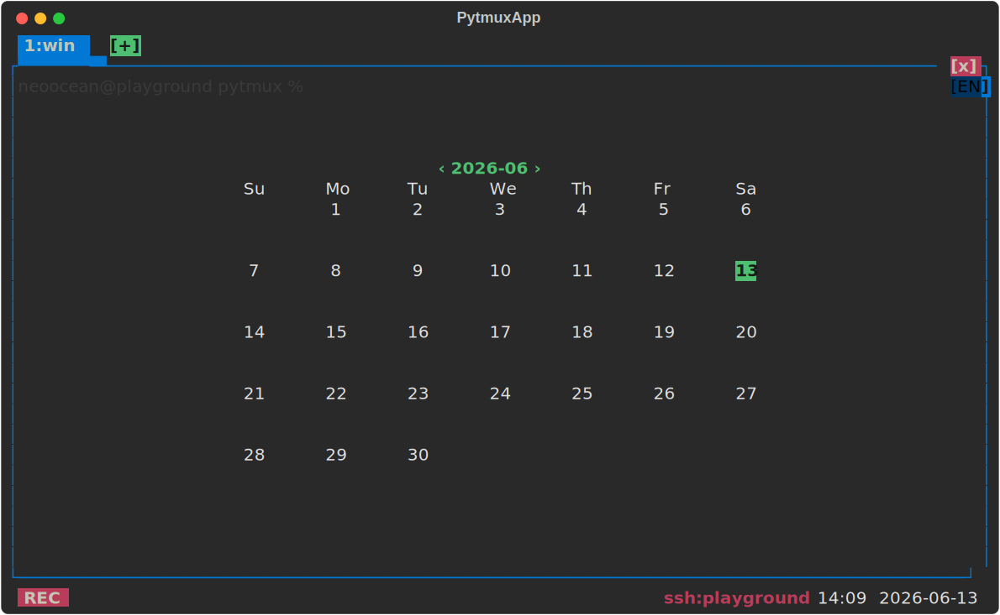

# calendar — 월간 달력 오버레이

현재 패널을 **이번 달 달력**으로 덮는 오버레이 플러그인([clock](../clock/) 의 미러 구현). 뒤 화면은 어둡게 깔리고 달력 그리드가 중앙에 그려지며 오늘 날짜가 강조된다. 자정을 넘기면 '오늘' 강조가 자동으로 이동한다. 한 패널엔 시계·달력 중 하나만 띄울 수 있다.

## 사용법

| 명령 | 별칭 | 동작 |
|---|---|---|
| `calendar-mode` | `calendar`, `cal` | 현재 패널 달력 토글 |
| `open-calendar` | `open-cal` | 달력 켜기 |
| `close-calendar` | `close-cal` | 달력 끄기 |

**달력이 떠 있을 때 키:**

| 키 | 동작 |
|---|---|
| `←` / `PageUp` / `[` | 이전 달 |
| `→` / `PageDown` / `]` | 다음 달 |
| `↑` / `↓` | 이전/다음 해 |
| `Home` / `.` | 오늘(이번 달)로 |

- **상태줄 날짜 영역 클릭** → 토글, 제목의 `‹` `›` 클릭 → 월 이동
- **패널 클릭 / Shift+ESC** → 닫기

옵션 없음(토글만).

## delete-to-disable

이 디렉토리를 지우면 명령·상태줄 클릭·키 네비게이션·렌더 훅(`client_overlay`·`client_overlay_key`·`client_tick`·`client_close_overlay`)이 사라진다. 코어는 `toggle_calendar`/`set_calendar` 를 `getattr` 로만 부르므로 무에러로 계속 동작한다.

지우지 않고 끄기: `:plugins`(별칭 `plugin-manager`) 로 여는 **플러그인 관리 팝업**에서도 이 플러그인을 토글로 끌 수 있다. 가역적이며 `opts.json` 의 `disabled_plugins` 에 영속되고, 같은 팝업에서 다시 켜면 돌아온다(서버가 새 비활성 집합을 전 클라에 방송해 명령·훅이 즉시 빠짐). 파일을 지우는 delete-to-disable 과 달리 되돌릴 수 있다.
