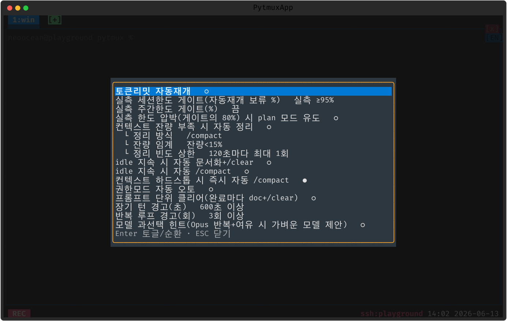

# claude-code — Claude Code 통합 (토큰 모니터링·표시·보조 자동화)

pytmux 안에서 돌아가는 [Claude Code](https://claude.com/claude-code) 세션을 **감시·보조**하는 종합 플러그인. 화면을 스크랩해 상태를 읽고, 상태줄에 토큰/모델/사용량을 표기하며, 토큰리밋 자동재개·세션 종료 토큰 화면 같은 보조 자동화를 (옵트인) 제공한다. 자동 액션은 안전 기본값이며 `token-saver` 팝업에서 토글한다.

> 위 스크린샷은 `token-saver` 설정 팝업. 상태줄 좌하단에는 활성 Claude 패널의 **모델 배지·컨텍스트%·5h 사용률%·계정**이, 임계 도달 시 **⚠ 경고** 배지가, 토큰리밋 자동재개가 무장되면 **⏳ 카운트다운** 배지가 함께 표기된다.

## 기능 범주

- **모니터링** — 활성 Claude 패널의 상태(idle/busy/limit), 토큰 사용량, 5h 한도 근접도, 컨텍스트 여유, 에러를 실시간 추적. 숨은 `/usage` 스크랩(`usageprobe`)으로 실측 세션·주간 한도를 가져와 근사 분모를 대체한다.
- **보조 자동화(옵트인)** — 토큰 리밋 자동재개, 전송 에러 자동 재시도, idle 시 권한모드 자동 전환, 프롬프트 단위 정리(완료마다 doc+/clear), 세션 종료 시 토큰 사용량 화면.
- **표시·팝업** — 상태줄 배지(위), 토큰 로그(`token-log`), 사용 한도 막대(`usage-panel`), 모델 변경(`model`), 권한모드(footer 클릭), 시작 규칙 편집(`claude-rules`).
- **알림만** — 장기 턴·반복 루프 경고(`⚠`).

## 주요 명령

| 명령 | 별칭 | 설명 |
|---|---|---|
| `token-saver` | `claude-settings`, `token-settings` | 토큰 절감 설정 팝업(아래 토글들) |
| `token-log` | `token-usage` | 토큰 사용량 집계 팝업(시/일/주/월×계정/세션) |
| `usage-panel` | `usage-limits`, `limits` | `/usage` 한도 막대(세션 5h·주 전체·주 Sonnet) |
| `claude-usage` | `usage` | 그림자 `/usage` 질의(실측 한도 갱신) |
| `model` | `model-config`, `claude-model` | 모델·컨텍스트 변경 팝업 |
| `claude-rules` | | 시작 규칙 편집(새 세션/clear 후 자동 주입) |
| `token-account <이름>` | | 활성 패널 계정 수동 지정(빈값=자동) |

**토글 명령**(`on`/`off`/무=토글): `auto-resume` · `auto-retry`(기본 on) · `auto-token-on-exit`(기본 on) · `claude-auto-mode` · `auto-launch`(기본 on) · `prompt-clear`.

## `token-saver` 설정 항목

토큰리밋 자동재개 · 세션 종료 시 토큰 사용량 화면 자동 표시 · 권한모드 자동 오토 · 프롬프트 단위 클리어 · 장기 턴 경고(초) · 반복 루프 경고(회).

**영속 옵션(`plugin_opts`):** `claude_auto_retry`(기본 True) · `token_debug`(기본 False) · `auto_token_on_exit`(기본 True) · `claude_auto_redraw`(기본 False — §10-I 화면 깨짐 완화: claude 패널 busy→idle 완료 경계마다 전체 재출력 1회).

## 상태줄·마우스

- **모델 배지 클릭** → 모델 변경 팝업. **사용량/계정 세그먼트 클릭** → 토큰 로그.
- **footer 권한모드 클릭** → 권한모드 선택 팝업(`bypass` 는 명시 사용자 의도 — 자동으로 안 건드림).
- 임계 80%/100% 도달 시 노랑/빨강 `⚠`, 무장된 토큰리밋 자동재개는 `⏳`+남은 초(입력하면 취소).

## delete-to-disable

이 디렉토리를 통째로 지우면 모든 Claude 명령·팝업·상태줄 배지·자동개입·토큰 추적이 사라지고, 서버엔 `ServerClaudeMixin` 이 합성되지 않는다. 코어는 플러그인 레지스트리로만 닿으므로 무에러로 계속 동작한다(delete-to-disable). 관련 설계는 [`docs/TOKEN_SAVING_SCENARIO.md`](../../../docs/TOKEN_SAVING_SCENARIO.md)·`TOKEN_ACCOUNTING_ACCURACY_SCENARIO.md` 참고.

지우지 않고 끄기: `:plugins`(별칭 `plugin-manager`) 로 여는 **플러그인 관리 팝업**에서도 이 플러그인을 토글로 끌 수 있다. 가역적이며 `opts.json` 의 `disabled_plugins` 에 영속되고, 같은 팝업에서 다시 켜면 돌아온다(서버가 새 비활성 집합을 전 클라에 방송해 명령·훅이 즉시 빠짐). 다만 서버측 `ServerClaudeMixin` 메서드는 import 시 이미 합성돼 있어, 런타임 비활성은 그 동작을 구동하는 훅(`server_scan` 등)이 안 불려 무동작이 되는 방식이다 — 메서드까지 완전히 빼려면 서버 재시작이 필요하다(`docs/PLUGIN_MANAGER_SCENARIO.md` §5).
