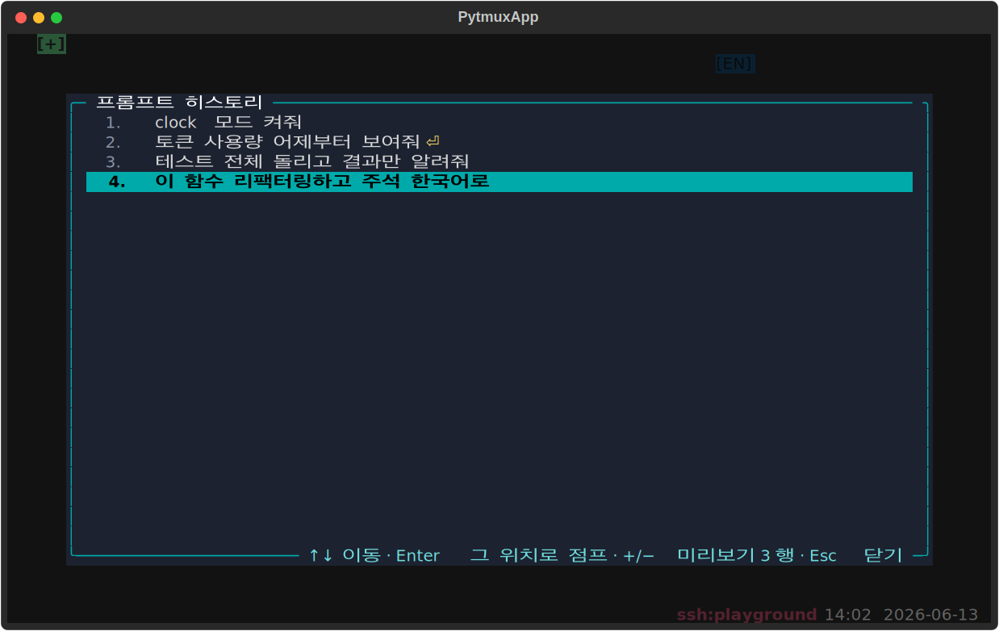

# claude-prompt-history — 프롬프트 히스토리 미리보기·점프

Claude 패널에 입력한 프롬프트들을 시간순으로 기록하고 **미리보기·검색·점프**하는 플러그인. 기존 단일행 스티키 헤더(claude-code 에서 제거됨)를 대체한다.

**세 가지 표면:**
- **추적** — Claude 패널 입력을 누적해 Enter 제출 시 한 항목으로 확정·영속. 멀티라인(⇧Enter)도 한 항목으로 보존, 제어 시퀀스·연속 중복 제외(패널당 최근 200개).
- **transient 미리보기** — `:` 명령으로 `prompt-history` 를 **작성하는 동안만** 대상 패널 외곽선 위에 직전 프롬프트를 1~3행 오버레이로 표시(작성 끝나면 소멸).
- **팝업·점프** — 팝업에서 ↑↓ 로 이전 프롬프트를 고르고 Enter 로 **그 프롬프트가 입력됐던 스크롤백 위치로 점프**한다(텍스트 검색 기반, 코어 무수정).

## 사용법

| 명령 | 별칭 | 동작 |
|---|---|---|
| `prompt-history` | `prompts`, `ph` | 히스토리 팝업 열기 |
| `prompt-history-lines <1-3>` | `ph-lines` | 미리보기 행수 설정(기본 3, 영속) |

**팝업 안에서 키:**

| 키 | 동작 |
|---|---|
| `↑` / `↓` · `Home`/`End` · `PgUp`/`PgDn` | 프롬프트 선택 |
| `Enter` | 선택 프롬프트 위치로 점프 + 닫기 |
| `+` / `-` | 미리보기 행수 1~3 조정(즉시 반영·영속) |
| `Esc` | 닫기 |

## 옵션/설정

- `ph_max_lines`(기본 3) — 미리보기 최대 행수(1~3). opts.json `plugin_opts` 에 영속.

## delete-to-disable

이 디렉토리를 지우면 명령·미리보기 오버레이·팝업·프롬프트 추적이 사라진다. 코어와 claude-code 는 영향 없다(claude-code 는 `getattr(pane, "_claude", None)` 약한 참조만 사용).

지우지 않고 끄기: `:plugins`(별칭 `plugin-manager`) 로 여는 **플러그인 관리 팝업**에서도 이 플러그인을 토글로 끌 수 있다. 가역적이며 `opts.json` 의 `disabled_plugins` 에 영속되고, 같은 팝업에서 다시 켜면 돌아온다(서버가 새 비활성 집합을 전 클라에 방송해 명령·훅이 즉시 빠짐). 파일을 지우는 delete-to-disable 과 달리 되돌릴 수 있다.
