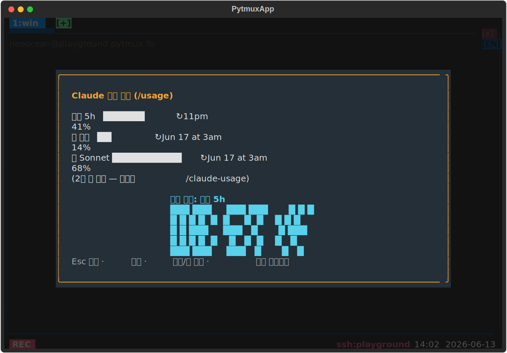

# claude-token-usage-view — 사용 한도 화면 + 리셋 카운트다운

Claude API **사용량 한도와 다음 리셋까지 남은 시간**을 한눈에 보는 화면. [claude-code](../claude-code/) 가 숨은 `/usage` 스크랩으로 status 에 실어둔 `usage_limits` 데이터를 재사용해, 세션 5h·주 전체·주 Sonnet 막대와 가장 이른 리셋의 카운트다운(대형 시계 폰트)을 그린다. 추가 네트워크 호출·의존성이 없어 가볍다.

## 사용법

| 명령 | 별칭 | 인자 |
|---|---|---|
| `usage-view` | `token-viewer`, `usage-clock` | `popup`(기본) · `tab` · `pane` |

- `popup` — 중앙 모달, `tab` — 풀스크린, `pane` — 활성 패널 오버레이 토글.

**화면 안에서 키:** `Esc`/`q` 닫기 · `[u]` 갱신(숨은 `/usage` 재실행) · `[t]` 팝업↔탭 · `[a]` → pane 오버레이.

옵션(plugin_opts) 없음 — 모드는 명령 인자로 고른다.

## 동작 방식

`UsageScreen`(`screen.py`)이 `app.status.usage_limits` 를 `getattr` 로 부드럽게 읽는다. claude-code 가 없거나 아직 실측 전이면 "한도 데이터 없음" 안내만 표시한다(하드 참조 금지). 막대·카운트다운은 코어 공유 유틸(`usage_bar_lines`·`_CLOCK_FONT`)을 재사용한다.

## delete-to-disable

이 디렉토리를 지우면 `usage-view` 명령과 pane 오버레이가 사라지고, 코어는 무에러로 계속 동작한다(하드 참조 없음).

지우지 않고 끄기: `:plugins`(별칭 `plugin-manager`) 로 여는 **플러그인 관리 팝업**에서도 이 플러그인을 토글로 끌 수 있다. 가역적이며 `opts.json` 의 `disabled_plugins` 에 영속되고, 같은 팝업에서 다시 켜면 돌아온다(서버가 새 비활성 집합을 전 클라에 방송해 명령·훅이 즉시 빠짐). 파일을 지우는 delete-to-disable 과 달리 되돌릴 수 있다.
