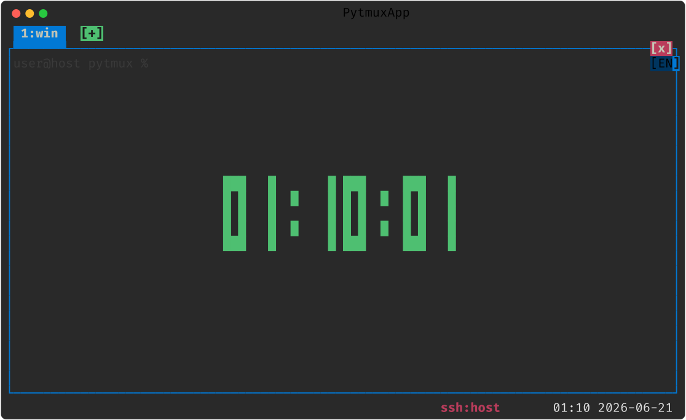

# clock — 대형 디지털 시계 오버레이

현재 패널을 **큰 디지털 시계**(시:분:초)로 덮는 오버레이 플러그인. 뒤 화면은 어둡게(실색 블렌드) 깔리고, 3×5 블록 폰트로 시각을 중앙에 그린다. 매초 자동 갱신된다. 한 패널엔 시계·달력 중 하나만 — 시계를 켜면 같은 패널의 달력은 자동으로 닫힌다.

## 사용법

| 명령 | 별칭 | 동작 |
|---|---|---|
| `clock-mode` | `clock` | 현재 패널 시계 토글 |
| `open-clock` | | 시계 켜기(이미 떠 있으면 유지) |
| `close-clock` | | 시계 끄기 |

- **상태줄 시각 영역 클릭** → 토글
- **ESC 모드 → `clock` 버튼** 또는 **Prefix `t`** 로도 진입
- **패널 클릭 / Shift+ESC** → 닫기

옵션 없음(토글만).

## 동작 방식

오버레이는 별도 화면 없이 패널 위에 직접 합성된다(`render.py: draw_clock_overlay`). 클라이언트 `client_overlay`·`client_tick`·`client_close_overlay` 훅으로만 코어에 닿는다.

## delete-to-disable

이 디렉토리를 통째로 지우면 명령·상태줄 클릭·렌더 훅이 모두 사라지고, 코어는 `toggle_clock`/`set_clock` 을 `getattr` 로만 부르므로 무에러로 계속 동작한다(코어 잔여 코드 없음 — `put_cell`·`_CLOCK_FONT` 만 코어 공유 유틸로 남음).

지우지 않고 끄기: `:plugins`(별칭 `plugin-manager`) 로 여는 **플러그인 관리 팝업**에서도 이 플러그인을 토글로 끌 수 있다. 가역적이며 `opts.json` 의 `disabled_plugins` 에 영속되고, 같은 팝업에서 다시 켜면 돌아온다(서버가 새 비활성 집합을 전 클라에 방송해 명령·훅이 즉시 빠짐). 파일을 지우는 delete-to-disable 과 달리 되돌릴 수 있다.
