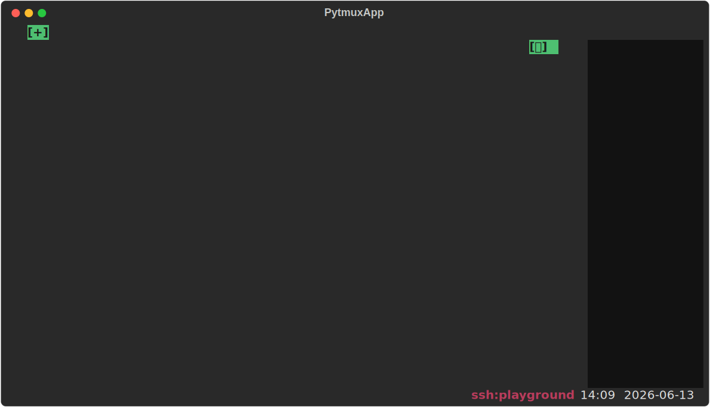

# ime-indicator — 한/영 입력 상태 배지

현재 키보드 입력소스(IME) 상태를 **`[한]` / `[EN]` 배지**로 표시하는 플러그인. 배지는 커서가 있는 줄의 오른쪽 끝(preedit 과 같은 높이)에 그려져 시선 이동을 최소화한다.

**감지 3계층(권위 우선순위 ①>②>③):**
- **① macOS 로컬 OS 실측** — HIToolbox TIS(장수명 freeze 회피용 감시 헬퍼 자식 프로세스, 진짜 CFRunLoop)·Windows IMM 으로 OS 입력소스를 읽어 입력이 없어도 모드 전환을 즉시 반영(권위값).
- **② ssh -R 에이전트 소켓(§9.1)** — plain ssh 원격에선 클라가 원격 박스 키보드를 봐 틀리다. **로컬 머신**에서 에이전트(`imeagent.py`)를 띄워 로컬 한/영을 unix 소켓으로 게시하고 `ssh -R` 로 역포워드하면, 원격 클라가 `PYTMUX_IME_SOCK` 에 붙어 정확한 로컬 한/영을 따라간다.
- **③ 확정 입력 휴리스틱(보편 폴백)** — ①②가 모두 없으면 확정 입력 문자의 스크립트로 추정(한글→`한`, ASCII→`EN`). 한글 모드에서 영문만 치면 `EN` 으로 보이는 한계가 있다.



## 사용법

| 명령 | 별칭 | 동작 |
|---|---|---|
| `ime-indicator` | `ime` | 배지 표시 ON/OFF 토글(기본 ON) |

- 배지 색: `[한]` = 초록(success), `[EN]` = 파랑(primary) 배경.
- `y=0`(첫 줄) 커서일 땐 탭 닫기 `[x]` 와 겹치지 않게 우측 4칸을 비운다.

옵션(plugin_opts) 없음 — 표시 토글만.

### ssh 원격에서 로컬 한/영 정확히 보기 (전송로 ②)

plain `ssh remote` 로 들어가 원격에서 pytmux 를 실행하면 배지는 기본적으로 ③ 휴리스틱으로 동작한다(영문만 칠 때 부정확). 로컬 한/영을 정확히 반영하려면 **로컬 머신**에서 에이전트를 띄우고 `ssh -R` 로 소켓을 역포워드한다:

```sh
# ① 로컬 머신에서 에이전트 실행(백그라운드)
python <pytmux>/pytmuxlib/plugins/ime-indicator/imeagent.py --sock /tmp/pytmux-ime.sock &

# ② 소켓을 역포워드해 ssh 접속(~/.ssh/config 에 RemoteForward 로 상시화 가능)
ssh -R /tmp/pytmux-ime.sock:/tmp/pytmux-ime.sock remote
#   sshd_config 에 'StreamLocalBindUnlink yes' 필요(stale 소켓 자동 정리), OpenSSH 6.7+

# ③ 원격에서 경로를 알리고 pytmux 실행
export PYTMUX_IME_SOCK=/tmp/pytmux-ime.sock
pytmux
```

에이전트가 없거나 끊기면 자동으로 ③ 휴리스틱으로 폴백하고, 에이전트가 (다시) 뜨면 1초 내 재연결한다. 와이어 포맷은 OS 입력소스 ID 한 줄(개행 종료)이라 macOS·Windows 로컬 양쪽을 그대로 흘린다.

## 동작 방식

화면 자체는 없고 `client_render`(프레임 합성) 훅에서 `render.py: draw_ime_indicator` 가 `app.ime_state` 를 읽어 배지를 그린다. macOS 실측은 `oskbd.current_source_id()`/`is_korean()` 이 담당한다. preedit(조합 중) 글자는 OS 오버레이라 확정 글자만 관찰된다.

## delete-to-disable

이 디렉토리를 지우면 `ime`/`ime-indicator` 명령과 `client_render` 배지 렌더가 사라진다. 상태(`app.ime_show`/`ime_state`)는 `attach_client` 가 설치하므로 플러그인이 없으면 코어가 직접 읽지 않는다 — 무에러로 계속 동작한다.

지우지 않고 끄기: `:plugins`(별칭 `plugin-manager`) 로 여는 **플러그인 관리 팝업**에서도 이 플러그인을 토글로 끌 수 있다. 가역적이며 `opts.json` 의 `disabled_plugins` 에 영속되고, 같은 팝업에서 다시 켜면 돌아온다(서버가 새 비활성 집합을 전 클라에 방송해 명령·훅이 즉시 빠짐). 파일을 지우는 delete-to-disable 과 달리 되돌릴 수 있다.
