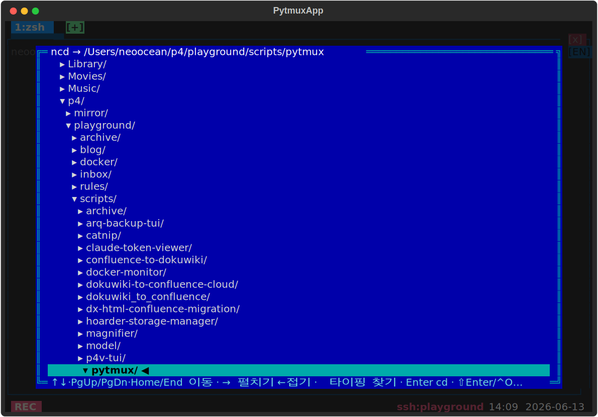

# ncd — 디렉토리 트리 점프 (Norton Change Directory)

Norton Commander 풍의 **디렉토리 트리 모달**(코드네임 nc). 루트(또는 Windows 드라이브 목록)부터 현재 패널 cwd 까지 **폴더만**(파일 제외) 펼쳐 띄우고 커서를 현재 디렉토리에 놓는다. 디렉토리명을 타이핑하면 speed-search 로 점프하고, Enter 로 그 폴더에 `cd`, ⇧Enter/^O 로 새 패널을 연다. 단일 `render_line` 위젯이라 선택 이동 시 변경된 두 줄만 다시 그려 ssh 원격에서도 빠르다.

## 사용법

| 명령 | 별칭 |
|---|---|
| `ncd` | `nc` |

**트리 안에서 키:**

| 키 | 동작 |
|---|---|
| `↑` / `↓` · `Home`/`End` · `PgUp`/`PgDn` | 커서 이동 |
| `→` | 폴더 펼치기(지연 로드) |
| `←` | 접기 / 부모로 |
| 글자 입력 | speed-search 점프(`Backspace` 삭제). 보이는 트리에 없으면 **트리에 안 열린 디렉토리까지 재귀 검색**해 그 경로를 펼쳐 선택(서버 `nc_find`, 2글자+) |
| `Enter` | 선택 폴더로 `cd` |
| `⇧Enter` / `^O` | 선택 폴더에 새 패널 분할 |
| `Esc` | 닫기 |

마우스 행 클릭으로 커서를 옮기고, **마우스 휠 위/아래로 목록을 스크롤**한다(선택은 뷰포트 안에 유지). 옵션 없음.

## 동작 방식

`ncd` 명령 → 클라가 `request_nc_list` 를 서버에 보내고, 서버 `nc_list_msg`(`server.py`)가 루트→cwd 사슬과 직계 하위를 회신하면 클라가 `NcdScreen`(`screen.py`)을 띄운다. `→` 펼치기마다 해당 폴더의 하위만 추가로 요청한다.

## delete-to-disable

이 디렉토리를 지우면 `ncd`/`nc` 명령·`app.request_nc_list` 글루·서버 `handle_server_request`·`NcdScreen` 이 모두 사라진다. 코어는 ncd 를 직접 참조하지 않으므로 무에러로 계속 동작한다.

지우지 않고 끄기: `:plugins`(별칭 `plugin-manager`) 로 여는 **플러그인 관리 팝업**에서도 이 플러그인을 토글로 끌 수 있다. 가역적이며 `opts.json` 의 `disabled_plugins` 에 영속되고, 같은 팝업에서 다시 켜면 돌아온다(서버가 새 비활성 집합을 전 클라에 방송해 명령·훅이 즉시 빠짐). 파일을 지우는 delete-to-disable 과 달리 되돌릴 수 있다.
