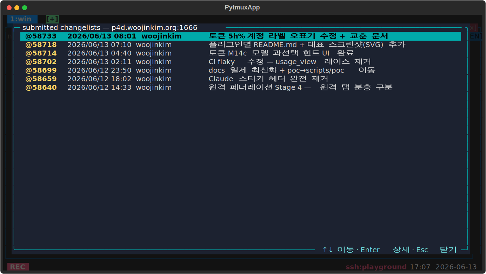

# p4-show-submitted-changelists — Perforce 제출 변경목록 보기

활성 패널 cwd 기준으로 Perforce 서버의 **최신 submitted changelist 목록**을 풀스크린으로 띄운다. `p4 changes -s submitted` 결과를 모달 화면에 표시하고, ↑↓ 로 고른 뒤 Enter 로 `p4 describe` 상세를 본다. cwd 의 `.p4config`/`P4CONFIG`/`p4 set`/환경변수를 그대로 honor 한다.

## 사용법

| 명령 | 별칭 | 인자 |
|---|---|---|
| `p4changes` | `submitted`, `p4-changes` | 개수 N(기본 50, 최대 500) |

**목록 화면:** `↑↓`/`Home`/`End`/`PgUp`/`PgDn` 이동 · `Enter` 선택 CL 상세 · `Esc`/`q` 닫기 · 행 클릭.
**상세 팝업:** `↑↓`/`PgUp`/`PgDn`/`Home`/`End` 스크롤 · `Esc` 목록으로.

옵션(plugin_opts) 없음 — 매번 명령으로 새로 조회한다.

## 동작 방식

`p4changes` → 클라가 `request_p4_changes` 를 서버로 보내고, 서버(`server.py`)가 활성 패널 cwd 에서 `p4 -G changes` 를 실행해 행 목록을 회신하면 클라가 `ChangesScreen`(`screen.py`)을 띄운다. Enter 시 `request_p4_describe` → `DescribeScreen`. 서버 탭은 항상 fresh 셸이라 데이터를 실을 수 없어 클라 모달로 설계됐다([claude-token-usage-view](../claude-token-usage-view/) 와 동일 패턴).

## delete-to-disable

이 디렉토리를 지우면 `p4changes`/`submitted`/`p4-changes` 명령과 서버 `handle_server_request`(`request_p4_changes`/`_describe` 회신)가 사라진다. 코어는 무에러로 계속 동작한다.
